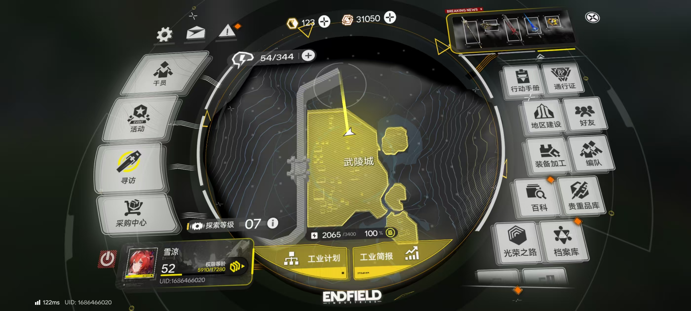
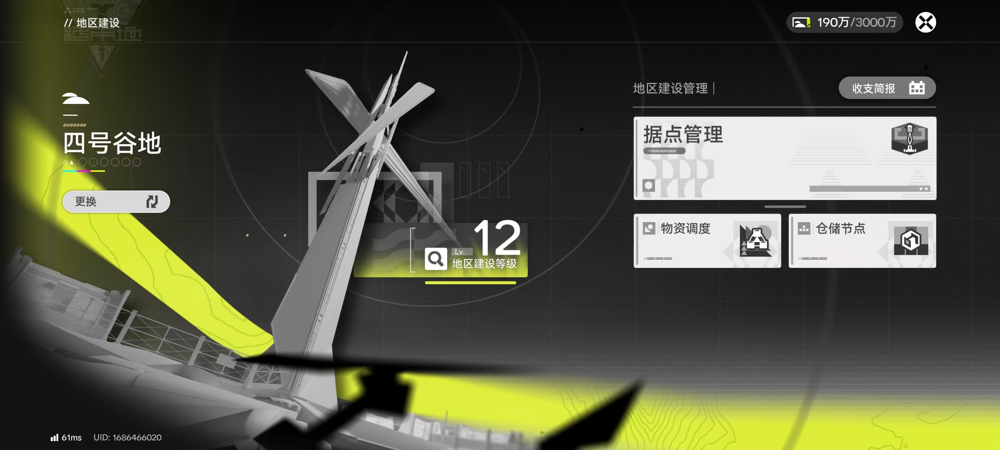
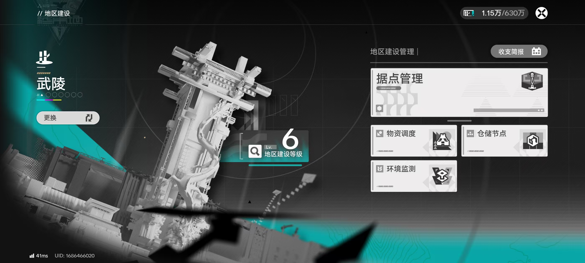
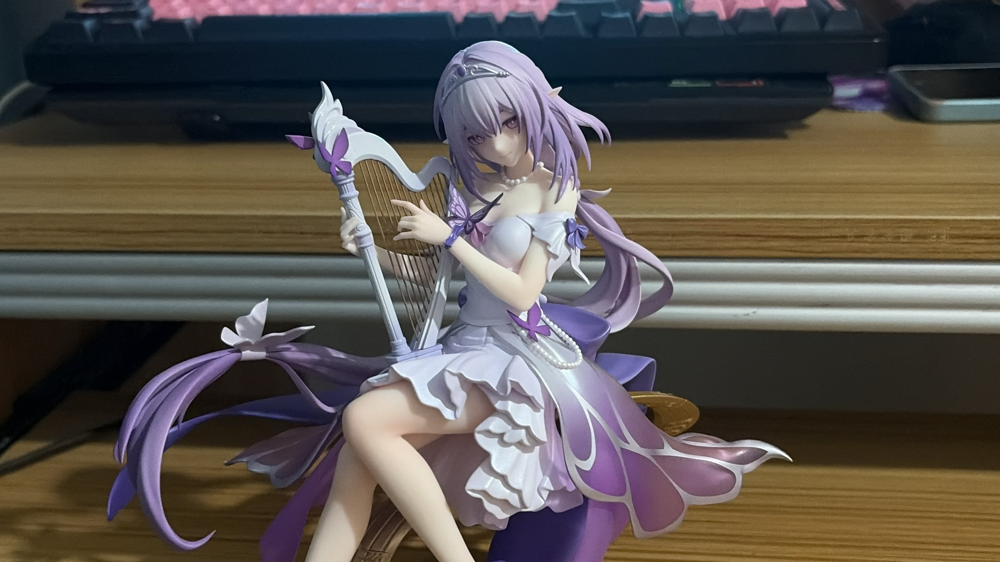

## # 拉电线上瘾了

最近日子过得比较"充实"——充实在《明日方舟：终末地》里。

自从终末地上线之后，我就沉迷于一件事：**拉电线**。

不知道有没有人和我一样，在游戏里可以花几个小时规划电力布局，研究怎么让电线走得最省材料、最整齐、最合理。虽然说游戏本身内容很丰富，但我偏偏对这种"基建规划"类的玩法有一种近乎变态的执念。

于是这周的生活就是这样的：

1. 起床 → 拉电线
2. 吃饭 → 拉电线  
3. 睡前 → 再拉一会儿电线

结果就是**这周完全没做什么新鲜事**，博客也鸽了好几天，代码也没怎么写。

但是快乐就完事了，不是吗？（心虚）

放几张最近的游戏截图，感受一下我的"基建成果"：

---

## # 备案二号：suzuki.ink

说点正经事。

之前提交的第二个备案域名终于下来了：**suzuki.ink**

说实话，当初申请这个域名纯粹是看它便宜，而且 `.ink` 后缀挺有意思的。但真正到手之后，我反而开始犯愁了——

> 这域名……用来干啥好？

目前脑子里有几个想法：

- 做一个纯静态的个人主页？
- 搞一个小工具站点？
- 或者就挂个"施工中"页面，等想好了再动工？

暂时还没想出来特别满意的方案，如果你们有什么建议，欢迎在评论区告诉我！

---

## # 新手办到货！

最近还到了一个新手办——**遐蝶**！

这是崩铁里超美的角色，紫色的长发配上优雅的竖琴造型真的太仙了。手办的做工非常精致，竖琴的细节、裙摆的飘逸感都很到位。

放一张实拍：

摆在桌上看着心情都变好了～

---

## # 碎碎念

农历新年快过完了，感觉假期还没开始就要结束了。

明天开始可能需要收收心，把拉电线的时间分一点出来写代码、更新博客。

不过也可能……

> 再拉一会儿电线也不是不行。

就这样，今天的流水账到此结束。各位晚安！🌙
