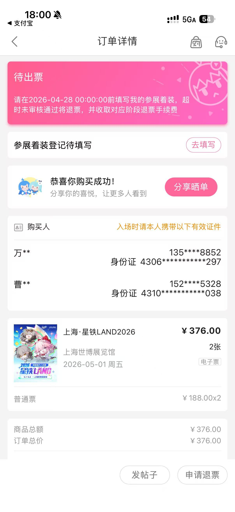

## # 先说结论：五一去星铁 LAND 嘉年华

五一假期终于要来了。

这次的计划也很简单：**去星铁 LAND 嘉年华**。

作为一个平时就会被各种游戏活动、联动周边、线下展会吸引过去的人，看到星铁这次搞嘉年华，说完全不心动肯定是假的。毕竟平时在游戏里跑列车、刷材料、看剧情，突然有机会去线下看看，总感觉还是挺有仪式感的。

> 从屏幕里走到现实里，多少还是有点「开拓者线下集合」的感觉。

当然，去之前最重要的一步不是查路线，也不是看攻略，而是——**抢票**。

---

## # 票是 4 月 24 日抢的

票是在 **4 月 24 日** 抢到的。

抢票这种事情，懂的都懂。打开页面之前想着「应该还好吧」，真到开抢的时候手指就开始不受控制地刷新，生怕慢一秒就只剩下空气。

好在最后还是顺利抢到了。

而且不是一张，是 **2 张**。

看到「恭喜你购买成功！」这几个字的时候，整个人都踏实了。

上海 · 星铁 LAND 2026，5 月 1 日，普通票，两张。

这不得浅浅炫耀一下？

抢到票那一刻的心情大概是：

> 好，五一有地方去了。

然后下一秒：

> 等等，我是不是还得规划路线、查时间、准备东西？

于是这件事就被我非常自然地放进了「之后再说」文件夹里。

---

## # 为什么今天才更新？

这个问题其实没有什么复杂原因。

不是因为忙到没时间写，也不是因为要憋一篇特别大的文章，更不是因为有什么神秘计划。

单纯就是——**懒**。

4 月 24 日抢完票之后，本来当天就该写一篇「我抢到票了」的小记录。结果想着「明天再写吧」，明天又想着「反正离五一还早」，然后一拖就拖到了今天。

这种事情发生在我身上一点都不奇怪。

毕竟博客更新这件事，很多时候不是没有内容，而是内容已经在脑子里写完了，手还没开始动。

> 大脑：这篇已经写好了。
>
> 键盘：我怎么不知道？

所以今天趁着假期前夕，还是把这篇补上。再不写，估计就要直接变成「游玩归来总结」了。

---

## # 出发前的小期待

目前还没正式去现场，所以这篇先算是一个出发前记录。

我对这次嘉年华最期待的，大概有几件事：

- 看看现场布置到底做得怎么样
- 拍点照片，留个纪念
- 看看有没有好玩的互动区域
- 如果有周边的话，顺手看看能不能带点什么回来
- 感受一下线下同好聚在一起的氛围

说实话，游戏线下活动最有意思的地方，有时候不只是官方准备了什么，而是你能在现场看到很多同样喜欢这个作品的人。

平时大家都隔着屏幕聊天、刷动态、看二创，线下活动就像是短暂地把这些热闹实体化了一下。

如果现场体验不错，应该会拍不少图。

如果现场体验一般，那也会写。

反正都去了，总得给这趟五一留点记录。

---

## # 后续会更新游玩后的文章

这篇就先写到这里。

等五一实际去完星铁 LAND 嘉年华之后，会再单独写一篇游玩后的记录，到时候再聊聊现场体验、排队情况、活动内容、周边，以及有没有什么意外收获。

希望到时候不是一篇「排队排到怀疑人生」。

当然，就算真的排队排到怀疑人生，应该也挺有节目效果的。

总之，票已经有了，人也差不多该准备出发了。

五一见，星铁 LAND。
