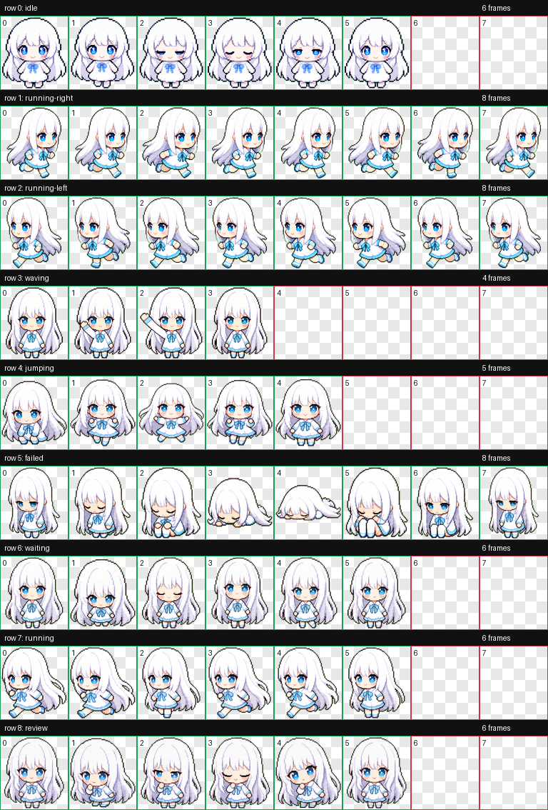
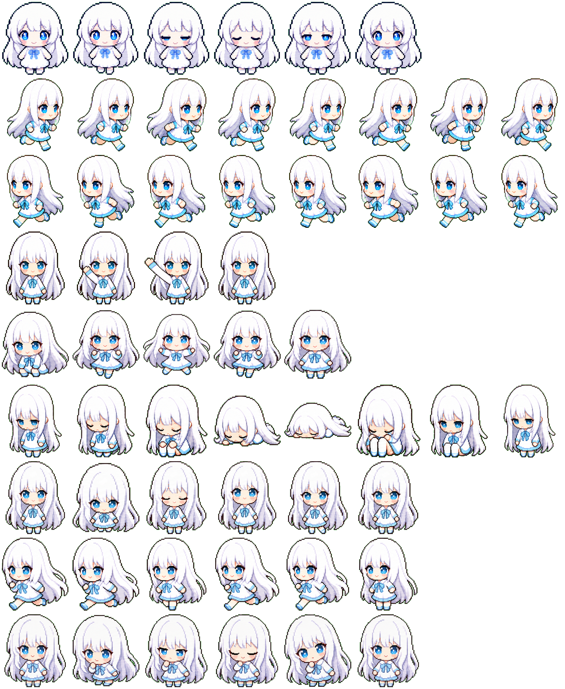

## # 先看成品：雪涼入住 Codex

今天给 Codex 做了一只自己的小宠物，名字叫 **YukiRyou**，中文名是 **雪涼**。

先说明一下，YukiRyou 不是这次临时起的名字，而是我早就确认好的角色名。雪涼也是我专门找人设计过的原创角色，所以这次与其说是“随便生成一只宠物”，不如说是把自己的角色做成 Codex 里的小伙伴。

简单来说，就是把雪涼的角色头像参考图，转换成 Codex 可以识别的 8×9 动画宠物图集，最后安装到本地的 `~/.codex/pets/YukiRyou` 里。

先放最终 QA 图：



整体效果还挺满意的。

白发、蓝眼、浅蓝蝴蝶结这些属于雪涼的特征都保留下来了，而且没有变成太复杂的立绘，而是被压缩成了那种小小的、像素风偏 Codex 内置宠物的样子。

> 这下不只是 Codex 在陪我写代码了，连旁边的小宠物也变成自己的了。

---

## # 参考图：这是雪涼的形象

这次用到的参考图是雪涼的头像：


这个角色本身的视觉特征很明确：

- 白色长发
- 蓝色大眼睛
- 温柔一点的表情
- 浅蓝色装饰
- 整体偏安静、可爱

不过直接把头像图做成宠物是不行的。Codex 宠物需要的是小尺寸动画 sprite，不是高清头像，也不是完整二次元立绘。

所以第一步要做的不是“照着画一张更精致的图”，而是把它**简化成一个能动的小型电子宠物形象**。

这一步我给它的方向大概是：在不丢掉雪涼识别点的前提下，把复杂角色设计简化成可动的小宠物。

> 长白发、蓝眼睛、淡淡腮红、浅蓝蝴蝶结，小小一只，轮廓清楚，表情温和，适合放进 192×208 的格子里动起来。

---

## # 生成主形象：把雪涼压缩成小宠物

生成主形象的时候，重点不是重新设计雪涼，而是做“宠物化”的转换。

换句话说，角色的名字、气质和关键特征都已经确定了，AI 需要做的是把它翻译成 Codex 小宠物能使用的视觉语言。

生成出来的主形象是这样的：


这个阶段最重要的是确定“本体设定”。

后面的所有动作都要以这张图为准，不能每一行都长得像不同角色。比如头发的轮廓、眼睛颜色、蝴蝶结、裙摆、整体比例，都要尽量锁死。

如果主形象阶段没定好，后面就会变成：

> idle 是一个人，running 是另一个人，failed 又突然换了发型。

那就不是宠物动画了，那是角色池十连。

---

## # hatch-pet 的工作流

这次主要用的是刚装好的 `$hatch-pet` 技能。

它的流程比普通生成一张图复杂很多，因为 Codex 宠物不是单图，而是一整套动画资源。

大概需要做这些东西：

1. 准备宠物 run 目录
2. 根据参考图生成主形象
3. 生成 9 行动作 strip
4. 把每一行动作拆成单帧
5. 合成最终 8×9 atlas
6. 检查透明背景、帧数、空白格
7. 生成 contact sheet 做人工检查
8. 打包成 `pet.json` + `spritesheet.webp`

最终 Codex 需要的是这样的文件结构：

```text
~/.codex/pets/YukiRyou/
  pet.json
  spritesheet.webp
```

其中 `spritesheet.webp` 是真正的动画图集，`pet.json` 则告诉 Codex 这个宠物叫什么、描述是什么、图集文件在哪里。

---

## # 动作生成：不是一张图，是九行动画

Codex 宠物的动作不是随便摆几个姿势就完事了，它有固定的状态行：

- `idle`
- `running-right`
- `running-left`
- `waving`
- `jumping`
- `failed`
- `waiting`
- `running`
- `review`

每一行还要求不同的帧数，比如 `running-right` 是 8 帧，`waving` 是 4 帧，`jumping` 是 5 帧。

这一步我先让子代理生成了 `idle` 和 `running-right`。

为什么先做这两个？

因为 `idle` 能看出主形象稳不稳，`running-right` 能看出动态的时候会不会变形。如果这两行都跑偏，后面一次性生成更多动作只会把问题扩大。

结果还不错：

- `idle`：6 帧，眨眼和呼吸都比较自然
- `running-right`：8 帧，跑动方向明确，没有速度线、阴影、尘土这些多余效果

之后检查了一下 `running-right`，发现 YukiRyou 没有文字、单侧标记、手持道具之类不能镜像的元素，所以 `running-left` 就直接由右跑镜像生成了。

> 能镜像就镜像，这种地方稳定比“重新发挥”更重要。

---

## # 子代理分工：让动作并行孵化

后面的动作行就交给子代理并行做了。

这次一共委派了这些动作：

- `idle`
- `running-right`
- `waving`
- `jumping`
- `failed`
- `waiting`
- `running`
- `review`

`running-left` 是我检查后从 `running-right` 镜像出来的。

子代理每个只负责一件事：根据 prompt 和参考图生成对应的一行动作，然后返回原始生成图路径。真正登记到 run、修改 manifest、合成图集、打包这些操作，还是由主流程统一处理。

这样做的好处是不会让多个代理同时改同一个 `imagegen-jobs.json`，否则很容易出现状态打架。

> 并行可以，但 manifest 不能群聊。

中间还遇到一个小插曲：我一开始并行登记 `idle` 和 `running-right`，结果 `running-right` 成功了，`idle` 那条没正常回传，看起来像是卡住了。后来改成单条命令依次登记，立刻就稳了。

果然，有些事情还是得慢慢来。

---

## # 最终图集：8×9 的 spritesheet

所有动作完成之后，就进入最终孵化阶段。

脚本会把每一行动作拆成单帧，再合成一张 `1536×1872` 的图集。每个格子是 `192×208`，刚好 8 列、9 行。

最终图集长这样：



这张图看起来密密麻麻，但对 Codex 来说它就是 YukiRyou 的全部动作来源。

QA 检查结果也过了：

- `spritesheet.webp`：`1536×1872`
- 格式：`WEBP`
- 模式：`RGBA`
- `validation.json`：无 errors、无 warnings
- `review.json`：无 errors、无 warnings

也就是说，透明背景、已使用格子、空白格、帧数这些都没问题。

---

## # 踩坑记录

这次制作过程里也不是一路丝滑。

### 1. 系统 Python 没有 Pillow

一开始直接跑脚本，结果系统里的 `python` 不存在，换成 `python3` 之后又提示没有 `PIL`。

最后用 Codex 自带的 workspace runtime 解决了：

```text
/Users/yukiryou/.cache/codex-runtimes/codex-primary-runtime/dependencies/python/bin/python3
```

这个 runtime 里有脚本需要的依赖，所以后续准备 run、抽帧、合成、校验都正常跑起来了。

### 2. 绿底有轻微不均匀

有几行动作生成时，子代理都提到绿色 chroma-key 背景有轻微 banding。

好在最终透明处理和 QA 没有报错，contact sheet 里也没有看到明显残留。这个问题算是有惊无险。

### 3. 没有 ffmpeg

`finalize_pet_run.py` 默认会生成 mp4 预览视频，但本机环境里没有 `ffmpeg`，所以第一次 finalize 在视频阶段失败了。

解决办法也很简单：加 `--skip-videos` 重新跑。

contact sheet 已经能完整检查每一行动画，所以这次就先不强求 mp4 预览了。

### 4. 写入 pets 目录需要权限

最后一步要写入：

```text
~/.codex/pets/YukiRyou
```

这个目录在当前 workspace 沙箱外，所以需要额外授权。授权之后就成功生成了：

```text
/Users/yukiryou/.codex/pets/YukiRyou/pet.json
/Users/yukiryou/.codex/pets/YukiRyou/spritesheet.webp
```

---

## # 最终安装结果

现在本地宠物目录里已经有了：

```json
{
  "id": "yukiryou",
  "displayName": "YukiRyou",
  "description": "Codex pet version of 雪涼 / YukiRyou, my original white-haired blue-eyed character.",
  "spritesheetPath": "spritesheet.webp"
}
```

这里的 `id` 是内部使用的 slug，真正显示出来的名字还是 `YukiRyou`。这意味着雪涼已经不只是停留在头像参考图里，而是变成了一个完整的 Codex 宠物包。

---

## # 碎碎念

这次做下来最大的感受是：做宠物比想象中更像做一个小型游戏素材管线。

它不是“生成一张可爱图片”这么简单，而是要考虑：

- 角色身份是否统一
- 每行动画帧数是否正确
- 背景能不能干净抠掉
- 透明格子是不是完全透明
- 动作有没有越界
- 最终图集能不能被 Codex 正确读取

不过最后看到 contact sheet 的时候还是挺开心的。

一排排小小的 YukiRyou 站在那里，会眨眼、会跑、会挥手、会等待、会失败趴下，突然就有一种“啊，真的做出来了”的感觉。

> 以后写代码的时候旁边蹲着自己的小宠物，这事听起来就很有精神安慰。

总之，YukiRyou 正式入住 Codex。

欢迎来到我的工作区。
