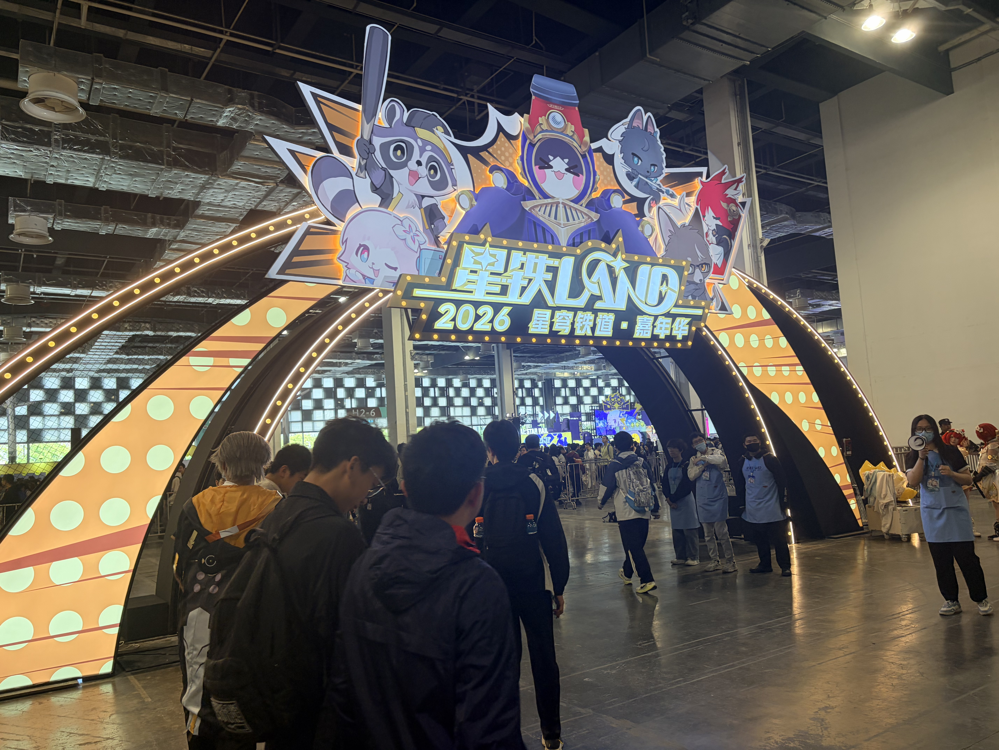

## # 五一去星铁LAND嘉年华了

五一假期第一天，去了期待已久的星铁LAND嘉年华。

体验总结：**人很多，队很长，也很快乐。**

---

## # 排队一小时起步

早上很早就出发了，想着早点去能少排点队。结果到了现场才发现——**想多了。**

现场的人比想象中多得多，从入口开始就排起了长队。进去之后发现，不管是玩项目、买周边还是吃饭，**所有地方都在排队。**

> 排队一小时起步，已经是常态。

项目排队、周边排队、连买瓶水都要排队。不过好在和朋友一起排队，边聊边等，时间也过得挺快。

---

## # 还原度很高的cos

现场最亮眼的还是各种cos。

不得不说，很多cos的还原度真的很高。从服装到道具，能看得出来大家都很用心。在现场逛的时候，感觉就像游戏里的角色真的从屏幕里走出来了一样。

> 看到喜欢的角色被用心还原，这种感觉真的很棒。

---

## # 走路真的很累

嘉年华场地比想象中要大很多。

从一个区域走到另一个区域，再加上排队时的来回走动，一天下来步数直接破万。到了下午的时候，脚已经开始发酸了，每走一步都觉得累。

这时候才发现，**选对搭子真的很重要。**

如果没有一个能一起坚持下来的朋友，估计早就想回去了。好搭子不仅能一起排队聊天，还能互相鼓励着走完这一天。

---

## # 总结：挺好玩的，也挺累的

虽然人多、队长、走路累，但整体来说还是挺好玩的。

能在现场感受到那种热闹的氛围，看到喜欢的角色cos，和朋友一起度过一整天，这些经历都挺值得的。

> 下次如果还来，可能会提前做好更充分的准备——比如穿一双更舒服的鞋。

总之，这趟五一星铁LAND嘉年华之旅，累是真的累，但快乐也是真的快乐。
