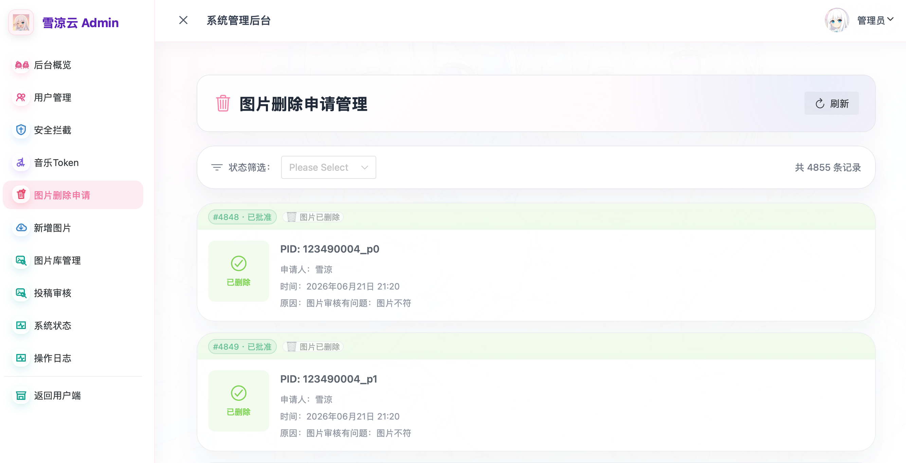

## # 前言：今天的眼睛有点累

今天主要在处理雪涼云的图片库审核。

目前图库里大概有接近 **3.7 万张图片**。这个数量说大不大，说小也绝对不小。平时作为 API 随机返回还好，一旦真的要重新整理质量、来源和可用性，就会发现这不是一个“点几下按钮”能解决的事情。

这轮主要筛的是几类图片：

- 原始图片源已经 404 或疑似失效。
- 图片质量过低。
- 画面过于 AI 化。
- 缩略图或原图加载异常。
- 不太适合继续留在正式图库里的内容。



后台现在已经积累了不少删除申请和审核记录。看着一条条图片信息、PID、来源和状态，其实还挺有实感：以前只是觉得“图库里有很多图”，真正开始清理的时候，才会发现每一张图都要付出判断成本。

---

## # 机审只能帮忙，最后还是得人看

这次新增了一层机审逻辑。

它会在机器比较闲的时候，对图库里的图片逐张进行检测，判断图片是否疑似失效。比如图片源是否还能访问、返回是否异常、资源是否可能已经 404。这部分由机器先跑一遍，可以把明显有问题的图片筛出来，减少人工从零开始翻图库的压力。

但机审目前只能做辅助。

图片是否“值得保留”，很多时候不是一个简单的 HTTP 状态码能决定的。比如：

- 图片能打开，但质量很差。
- 图片没失效，但内容明显不适合继续入库。
- 图片看起来完整，但压缩、裁切或清晰度都有问题。
- 图片来源正常，但画面过于 AI 化，不符合当前图库想要的方向。

这些最后还是要人工复审。

所以这一轮基本还是我和管理员一点点看图，确认是否失效、质量如何、需不需要删除。看久了是真的眼睛发花，尤其是一批图里有正常图、坏图、低质图、AI 味很重的图混在一起时，判断会变得很消耗注意力。

但这一步又绕不过去。雪涼云 API 如果想继续稳定提供图片服务，图库质量就不能完全放任它自然堆积。

---

## # 先筛，再新增

这轮图库维护的顺序是：**先清理，再新增**。

如果旧图库里已经有一堆失效、低质或不适合的图片，还继续往里面加新图，短期看起来数量会上去，但整体质量不会变好。随机 API 的体验也会被这些问题图拉下来。

所以我现在的想法是：

1. 先把疑似失效和明显低质的图片筛一轮。
2. 人工复审机器标记出来的问题图。
3. 删除确实不适合继续保留的图片。
4. 再开始做新图片的新增和更新。

这套流程跑完之后，图库应该会更干净一点。后续再新增图片时，也会更容易维护质量基线，而不是一边加一边被旧问题拖着走。

---

## # 终末地插件 Wiki 也更新了

最近还把终末地插件的 Wiki 功能更新上去了。

目前它还算是 **beta 版本**。功能已经能跑，比如 Wiki 搜索、目录、详情、语音资源、MV / 演示资源这些都接进了插件里，但数据量确实很大，很多细节只能慢慢补。

终末地 Wiki 这类东西不是写几个命令就结束了。背后有条目、分类、标签、干员资料、语音、图片、官方文档结构，还有各种不同类型的资源。网页端能看是一回事，Bot 里要把它变成适合 QQ 群阅读的卡片和文件发送，又是另一回事。

所以这次先把基础链路接上，后面再一点点打磨：

- 搜索结果展示。
- 条目详情渲染。
- 干员资料卡。
- 语音资源发送。
- MV / 演示资源解析。
- Wiki 帮助命令。
- OneBot 文件发送兼容。

这部分不会一下子完美，但至少它已经从“以后再说”变成了“先跑起来再迭代”。

---

## # 为什么插件停了一段时间

其实这个插件已经有一段时间没有高频更新了。

原因也很简单：我自己暂时退游终末地了。

不是因为终末地不好玩。相反，我一直觉得终末地是个好游戏，题材、工业系统、探索和角色都挺有意思。但它也确实太肝了。最近事情太多，工作也到了新的阶段，再继续保持游戏进度、项目维护和日常生活一起跑，实在有点吃不消。

所以我只能先暂时退游。

而第二个原因，其实也是第一个原因衍生出来的：我自己不玩了，这个插件对我来说自然也就没那么“刚需”了。

以前我每天会用插件查数据、看提醒、顺手修问题。现在自己不用了，维护动力肯定会下降。这件事没什么好回避的。

但还有少量用户在用我的服务。

只要还有人在用，插件就不只是“我自己的玩具”。不管是雪涼云 API、终末地 API，还是后续可能推出的其他服务，只要我还在维护，我都会尽量继续免费提供。

---

## # 给还在使用服务的用户一点补偿

这段时间插件断更过，也有一些功能停在“能用但没继续打磨”的状态。对还在使用这些服务的用户来说，这其实不太好。

所以这里做一个小补偿：

**从这篇文章发布起，前 3 个通过 QQ 联系我的、仍在使用我服务的用户，每人一张终末地月卡。**

联系方式：

```text
QQ：1207211555
```

文章还在，这个说明就生效。

数量不多，也不是什么很大的补偿，只是想表达一下感谢。谢谢还在用雪涼云、终末地 API 和终末地插件的大家。哪怕用户不多，对我来说也意味着这些东西不是完全没人需要。

---

## # 小结：慢慢维护，继续免费

今天做图片库审核，最大的感受就是：个人项目一旦跑久了，真正麻烦的往往不是“新增功能”，而是维护。

3.7 万张图片需要清理，Wiki 数据要慢慢补，Bot 插件要兼容不同环境，API 服务要稳定，图片源要有效，用户体验还不能太差。每一件单独看都不算夸张，叠在一起就会变成很长的待办清单。

最近也顺手把雪涼云 API 的发布流程正规化了一些，改成通过 GitHub 工作流自动化部署。以前很多时候还是偏手动处理，能跑是能跑，但每次更新都要多留一份心。接入工作流之后，至少部署链路更清楚，更新、构建、发布这些步骤也更容易固定下来。

但我还是会继续做。

节奏可能不会像刚开始那样快，也不一定每个功能都能马上做到理想状态。但雪涼云 API、终末地 API、终末地插件，以及后续可能推出的服务，只要还在我的维护范围内，就会继续尽量保持免费。

这轮图片库筛完之后，再继续做图库新增和更新。终末地 Wiki 也会继续从 beta 慢慢往更完整的版本推进。

先把眼睛休息一下。
