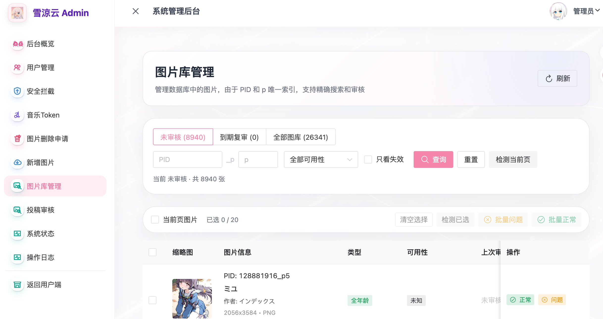

## # 前言：今天迁了生产数据库

今天把 **雪涼云 API 的生产环境数据库** 正式迁移到了 **阿里云 RDS MySQL**。

这种事情看起来只是一句“换个数据库”，但真正做的时候还是会下意识绷紧一点。毕竟这是生产环境，里面不只是用户数据，还有图片库、投稿、审核、调用记录、音乐相关数据，以及一堆支撑雪涼云正常运行的状态信息。

好在这次迁移过程很顺利。

迁移完成之后，生产环境已经完整切到新的 RDS 数据库，目前运行正常，没有发现问题。再加上正式图片库的第一轮筛查也快结束了，今天心情确实挺愉悦。

---

## # 迁移前：先备份，再验证

生产数据库迁移最重要的一点是：不能急。

这次没有直接把生产环境指向新库，而是先完整备份了原数据库。备份完成后，又在本地做了一轮导入测试。

流程大概是这样：

1. 备份原生产数据库。
2. 在本地测试环境导入备份数据。
3. 对比本地导入后的数据量和原数据库数据量。
4. 确认数据一致后，再导入阿里云 RDS MySQL。
5. 最后切换生产环境连接到 RDS。

本地导入校验这一步很有必要。

如果备份文件本身不完整，或者导入过程中有编码、索引、字段类型、约束之类的问题，直接在 RDS 上发现会非常难受。本地先跑一遍，至少能确认这份备份是可恢复的，导入后的数据量也和原库一致。

对我来说，这一步就是给自己吃一颗定心丸。

---

## # 导入 RDS：正式接管生产环境

本地验证通过之后，才开始把数据导入到阿里云 RDS MySQL。

导入完成后，又重新确认了一遍关键数据表和数据量。确认没有明显异常之后，再把生产环境完整切换到迁移后的数据库。

这次切换后的结果很理想：

- 生产环境连接正常。
- API 调用正常。
- 后台管理页面正常。
- 图片库查询正常。
- 图片审核相关功能正常。
- 当前没有发现数据异常。

从结果上看，这次迁移任务算是完美完成。

以前数据库更多还是偏“自己维护一台机器上的服务”。迁到 RDS 之后，至少在备份、稳定性、监控和后续维护上会更正规一点。雪涼云现在虽然还是个人项目，但服务跑久了之后，基础设施也不能一直停留在“能用就行”的阶段。

---

## # 为什么要迁到 RDS

这段时间雪涼云做了不少基础设施上的整理。

前面已经把 API 部署流程接到了 GitHub 工作流，让构建和发布更自动化；现在数据库也迁到了 RDS。两件事放在一起，其实都是同一个方向：把雪涼云从“手工维护的小项目”慢慢往更稳定、更容易长期维护的服务形态推。

RDS 对现在的雪涼云来说，主要意义在这些地方：

- 数据库服务更独立，不和业务进程挤在一起。
- 后续备份和恢复更有保障。
- 生产环境维护边界更清楚。
- 后续扩展、监控和排障更方便。
- 真要做迁移或回滚时，流程也更容易标准化。

当然，RDS 也意味着新的成本。但只要服务还打算继续跑下去，这类成本我觉得是可以接受的。比起哪天因为数据库维护不规范把自己折腾到半夜，提前把底座搭稳一点，反而更省心。

---

## # 图片库第一轮筛查也快结束了

除了数据库迁移，最近另一件大事就是正式图片库的第一轮筛查。

前几天还在说雪涼云图库接近 3.7 万张图片，需要对失效图、低质量图片、过度 AI 化图片做一轮筛查。现在这一轮已经快结束了。

后台里可以看到，当前未审核图片还有一部分，全部图库数量也已经稳定在一个更清晰的范围内。机器检测能先帮忙判断疑似失效，但最后还是需要人工看图确认。这个过程很慢，也挺费眼睛，但做到现在，能明显感觉图库状态比之前清爽了很多。

这一轮筛完之后，后面就可以更放心地做新增图片和更新。

先把旧库里明显有问题的内容清掉，再补充新内容，这样雪涼云 API 返回图片时的整体质量才会更稳定。

---

## # 小结：今天很顺

今天两件事都挺顺。

生产数据库迁移到阿里云 RDS MySQL，备份、测试导入、数据量校验、RDS 导入、生产切换全部跑完，目前没有任何问题。

正式图片库的第一轮筛查也快结束了。虽然这几天看图看到眼睛发花，但能看到图库一点点变干净，还是挺有成就感的。

雪涼云最近做的事情，很多都不是用户一眼能看到的新功能：GitHub 工作流自动部署、RDS 数据库迁移、图库机审和人工复审、后台审核流程整理。这些更像是把地基重新夯一遍。

地基稳一点，后面继续做图库投稿、图片更新、音乐服务和其他 API 功能时，心里也会踏实一点。

总之，今天心情愉悦。
