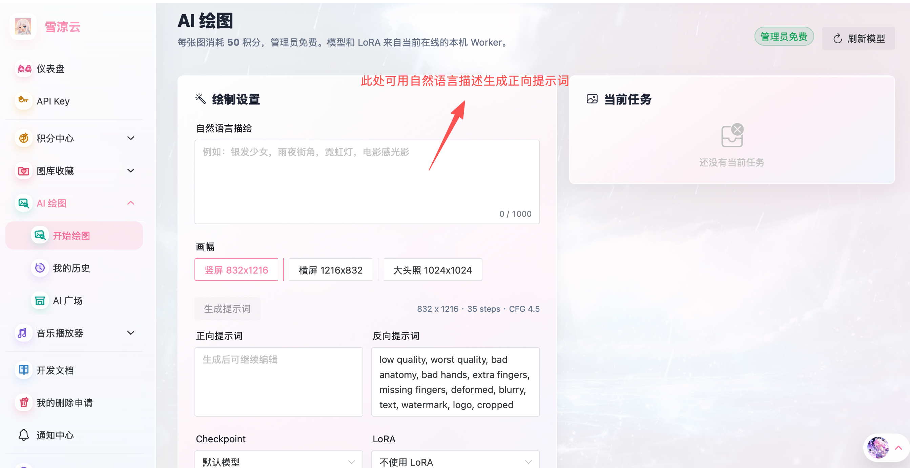
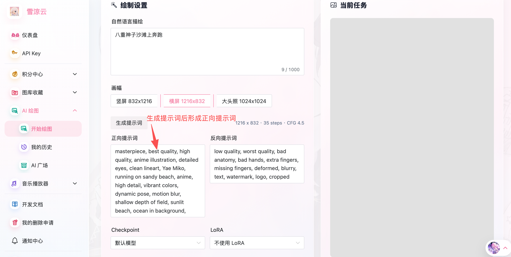
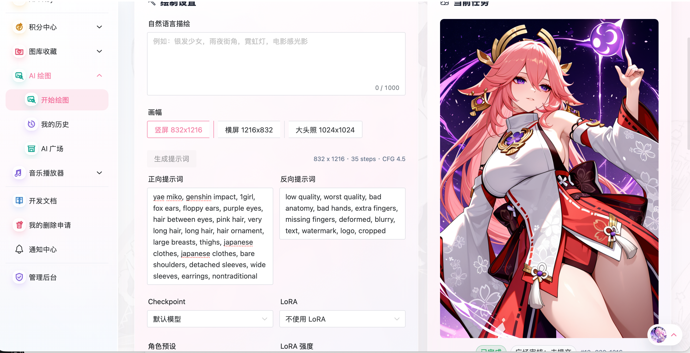

## # 前言：闲置电脑终于有活干了

今天雪涼云更新了一个新功能：**AI 绘图**。

这次我把闲置的电脑拿出来跑 AI 绘图，本机负责 ComfyUI 和 Worker，雪涼云云端负责用户、积分、任务、历史、OSS 存储、广场审核这些业务流程。

目前这个功能还是 **Beta 版本**。能用，能出图，也已经接上了历史和广场，但很多地方还不成熟：自然语言提示词转换、模型预设、LoRA 预设、生成稳定性、排队体验、广场生态都还需要继续打磨。

不过先让它跑起来，后面才有东西可以慢慢改。

---

## # 现在的整体流程

雪涼云 AI 绘图不是让云服务器直接跑模型，而是走了一条“云端调度 + 本机 Worker”的链路。

大概流程是：

1. 用户在雪涼云前端提交绘图任务。
2. 云端后端检查登录态和积分。
3. 普通用户扣除 50 积分，管理员免费。
4. 任务进入云端队列。
5. 闲置电脑上的 Worker 主动轮询并领取任务。
6. Worker 调用本机 ComfyUI 出图。
7. 图片回传云端并写入 OSS。
8. 用户在当前任务或生成历史里查看图片。

这个设计的好处是，本机不需要暴露公网端口。云服务器不用访问我的电脑，Worker 主动去云端领任务就行。

对我来说，这种方式比较适合现在的状态：先把闲置机器利用起来，不急着上专门的 GPU 云服务，也不用一开始就承担太高的固定成本。

---

## # 怎么使用

入口在雪涼云控制台左侧：

```text
AI 绘图 -> 开始绘图
```

页面里可以看到：

- 自然语言描述。
- 正向提示词。
- 反向提示词。
- 画幅选择。
- Checkpoint 选择。
- LoRA 选择。
- 角色预设。
- LoRA 强度。
- 当前任务状态。



每张图默认消耗 `50` 积分，管理员账号免费。模型和 LoRA 来自当前在线的本机 Worker，所以如果我本机没有启动，或者 Worker 没有上报能力，前端可选模型也会跟着变化。

---

## # 自然语言生图还在 Beta

页面最上面有“自然语言描述”。

这里的设计目标是：用户输入中文描述，比如“银发少女，雨夜街角，霓虹灯，电影感光影”，系统再帮忙生成正向提示词和反向提示词。

但目前这个能力还在 Beta，效果并不稳定，所以这篇暂时不展示自然语言直接生图的结果。

现在更推荐的方式是：直接使用相对标准的英文提示词。

比如可以去这个页面搜索角色提示词：

[NoobAI-XL Danbooru Character](https://www.downloadmost.com/NoobAI-XL/danbooru-character/)

里面可以通过英文名搜索角色。比如八重神子可以搜：

```text
Yae Miko
```

找到角色提示词后，再放进雪涼云的正向提示词里，效果通常会比纯自然语言描述更稳定一些。

---

## # 一个简单例子

比如我先在自然语言里写：

```text
八重神子沙滩上奔跑
```

然后点击“生成提示词”，系统会生成一段可继续编辑的正向提示词。



当然，如果知道角色 tag，也可以直接写类似：

```text
yae miko, genshin impact, 1girl, fox ears, purple eyes, pink hair
```

再补一些画质、构图和场景词。

当前默认反向提示词里会带一些基础负面词，比如：

```text
low quality, worst quality, bad anatomy, bad hands, extra fingers, missing fingers, deformed, blurry, text, watermark, logo, cropped
```

然后选择画幅，比如：

- 竖屏 `832x1216`
- 横屏 `1216x832`
- 大头照 `1024x1024`

最后提交任务，等待右侧当前任务更新。

下面是这次测试生成出来的效果：



这张图不代表最终质量，只是当前 Beta 版本的一次生成结果。后面随着模型、LoRA、角色预设和提示词处理继续补齐，效果应该还会继续往上走。

---

## # 生成历史和 AI 广场

生成完成后，图片不会只显示在当前任务里。

你可以进入：

```text
AI 绘图 -> 我的历史
```

这里会看到自己生成过的所有图片。

历史里可以做几件事：

- 查看生成图。
- 复用 prompt 和生成参数。
- 查看任务状态。
- 提交删除申请。
- 把满意的图片提交到 AI 广场审核。

如果想公开展示，可以把生成图提交审核到：

```text
AI 广场
```

提交时可以选择全年龄或 R18。通过管理员审核后，图片才会进入公开广场；审核中、审核拒绝、已删除或已下架的图片不会公开展示。

这部分是为了避免 AI 广场一开始就变成不可控内容池。AI 生图越开放，越需要审核和下架流程兜住。

---

## # 目前还有很多要补

这次刚部署完成，很多东西还没有那么成熟。

后续准备继续补：

- 更多 LoRA 预设。
- 更好用的角色预设。
- 更稳定的自然语言提示词生成。
- 更明确的排队状态。
- 生成失败原因提示。
- 更完整的历史复用体验。
- AI 广场展示优化。
- 管理员审核和删除流程细节优化。

现在先把基本链路跑通：能提交任务、能扣积分、能由 Worker 出图、能写入 OSS、能在历史里查看、能提交审核到广场。

这一步完成之后，后面才是慢慢补体验。

---

## # 小结

雪涼云 2.6.0 这次把 AI 绘图接进来了。

对用户来说，它是一个新的控制台功能：输入提示词、选择画幅、提交任务，然后在历史里查看生成结果。

对我来说，它更像是一次基础设施实验：把闲置电脑变成 AI Worker，让云端只负责业务和调度，不直接承担 GPU 推理成本。

现在它还只是 Beta 版本，效果不会每次都稳定，也还有很多细节要补。但这条链路已经跑通了，后面就可以继续加模型、加 LoRA、调提示词、补广场和审核体验。

先让闲置电脑开始上班。
