## # 前言：正式版终于准备上线了

今天终于打算把雪涼云 **AI 绘画**上线正式版啦。

目前整体效果我自己还算挺满意，生成出来的图也比前几个版本稳定了不少。当然，这里只展示能展示的部分，NSFW 内容就不放出来了，大家自己去体验就好。

先放两张这次生成出来的图：

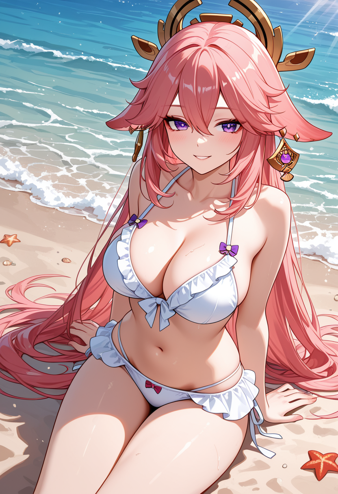

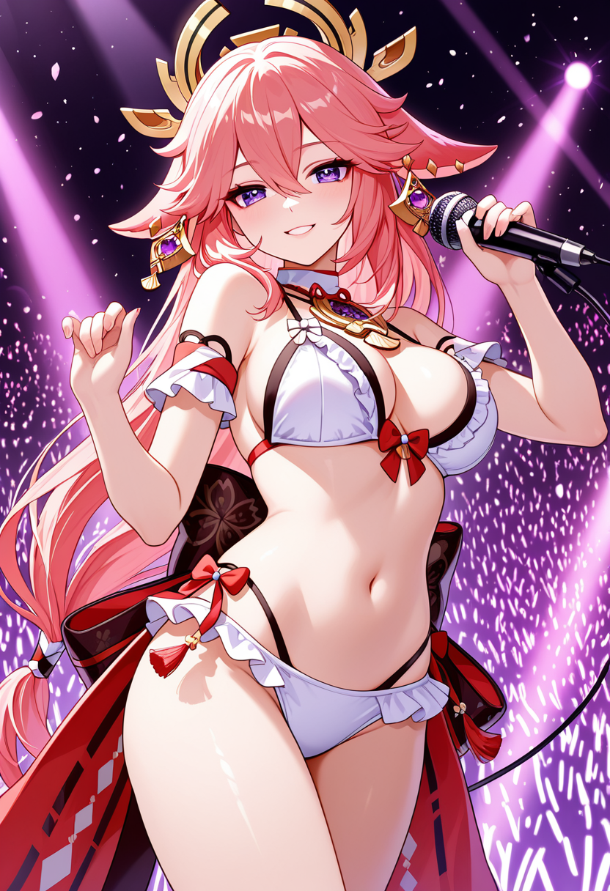

接下来简单讲一下，新手应该怎么上手这个 AI 绘画功能。

## # 为什么要准备这么多预设

这次我给大家准备了大量预设。

原因很简单：虽然理论上大家可以直接通过自然语言描述自己想要的画面，但实话实说，新手一开始可能想象力还没有完全打开，也不一定熟悉各种 prompt tags。

所以预设的目的，就是尽量简化用户的思维操作。

你不需要一开始就知道角色触发词、LoRA 文件名、推荐模型、正向提示词、反向提示词这些东西分别怎么写。先从预设开始点，至少能比较快地生成一张方向正确、效果还不错的图。

目前生图分为 **单角色生图** 和 **双角色生图**。这篇先以单角色生图为例。

## # 自然语言描绘

页面里有一个“自然语言描绘”区域。

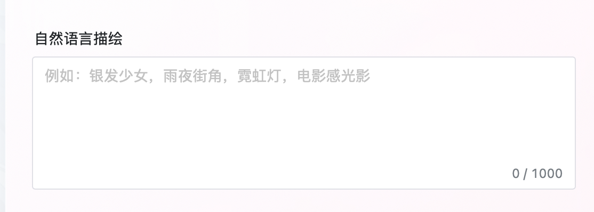

它的作用是把用户输入的自然语言，转换成 AI 更容易听懂的“绘图语言”。

比如你写：

```text
银发少女，雨夜街角，霓虹灯，电影感光影
```

系统会尝试把它转换成更适合绘图模型理解的正向提示词和反向提示词。

不过新手刚开始可以先不管这里，直接用后面提到的预设会更快。

## # 选择画幅和模型

然后选择你想要生成的画幅。

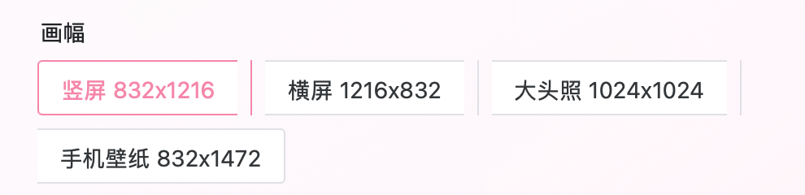

目前有竖屏、横屏、大头照、手机壁纸等尺寸。想发图或者做头像，可以根据用途自己选。

接着可以选择 Checkpoint，也就是这次生成使用的模型。

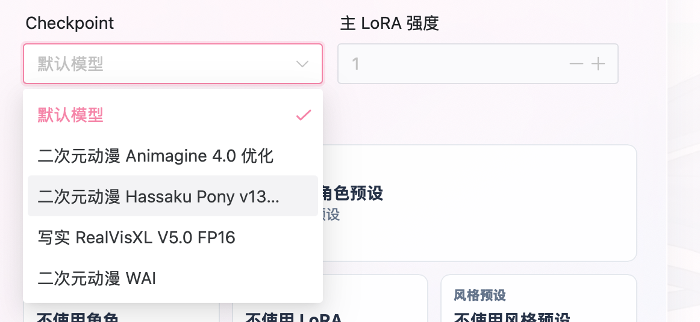

默认模型是我目前认为效果最好的模型。其他模型大家也可以自己试试，不过这篇后面的演示都会继续用默认模型。

## # 配置 AI 资产

接下来是 AI 资产，也就是我给大家准备的预设组合。

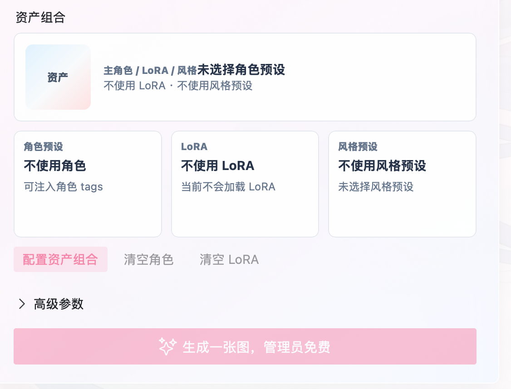

这里也是新手最快生成好图的方法。

点进配置页后，可以看到 AI 资产分为三类：

- LoRA
- 角色预设
- 风格预设

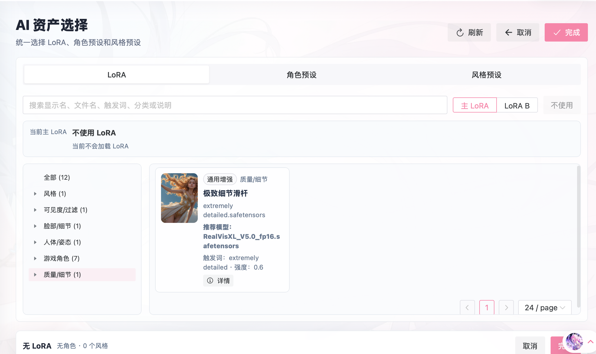

默认情况下，你可以不使用 LoRA，也可以不使用角色预设。什么都不选也能生成，只是效果会更依赖你自己写的提示词。

如果想生成某个具体角色，比如八重神子，就可以先在 LoRA 里选择八重神子的 LoRA。

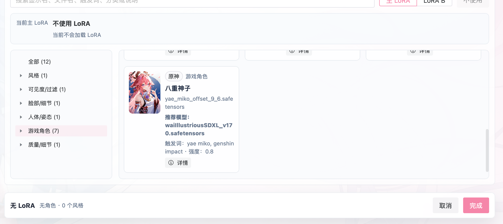

选完之后不要急着退出。

直接在上方继续切到“角色预设”，同样选择八重神子。

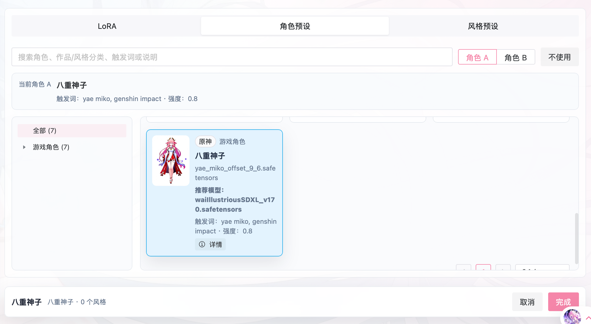

角色预设会注入角色相关 tags，LoRA 则负责强化角色特征。两者配合起来，效果会比只写几个角色关键词稳定很多。

## # 选择风格预设

风格预设分为 SFW 和 NSFW。

这里以 SFW 为例，选择一个“可爱比基尼”之类的风格预设，然后点击完成。

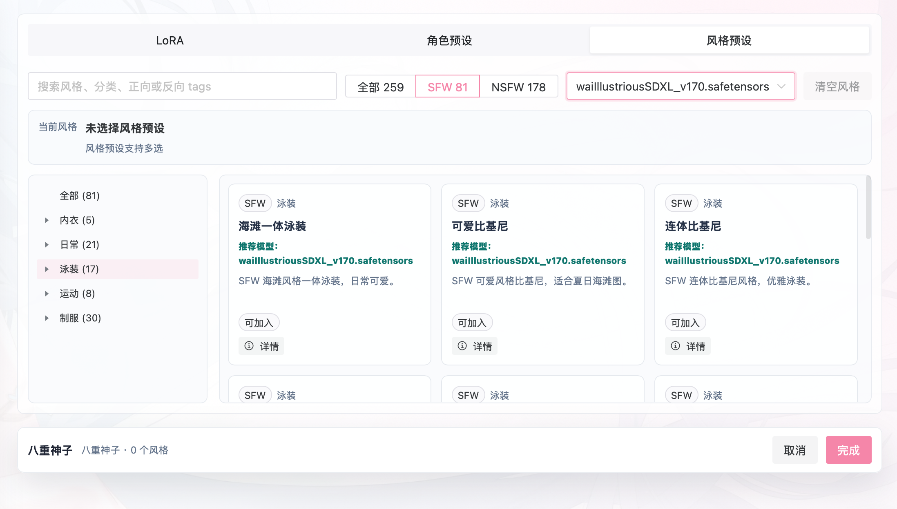

完成后，你选择的 LoRA、角色预设和风格预设会被注入到正向提示词和反向提示词里。

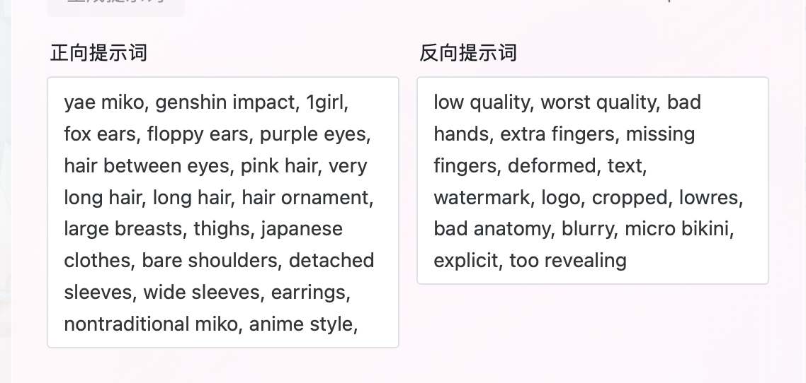

简单来说，这些提示词就是 AI 绘图真正能听懂的语言。

你可以直接生成，也可以在这个基础上继续改，比如补充场景、动作、镜头、光影、表情等。

## # NSFW 兼容模式

这里还有一个比较有意思的开关：**NSFW 兼容模式**。

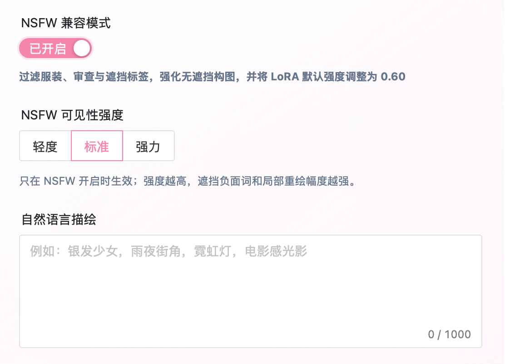

它实际上的作用，是清理角色预设里原本包含的一些衣物提示词。

即使是生成 SFW 图片，也可以开启这个开关。比如某些角色预设默认带了原作服装，开启后可以减少原作服装对风格预设的干扰。

不过不建议新手直接开“强力”。

强力模式会尝试清理所有衣物相关提示词，很大概率会生成 NSFW 内容。想稳定生成全年龄图片的话，标准模式就够了。

## # 开始生成和查看历史

配置好之后，就可以开始生成啦。

生成任务提交后，会出现在“最近生成”里，同时也会有一个当前任务状态。

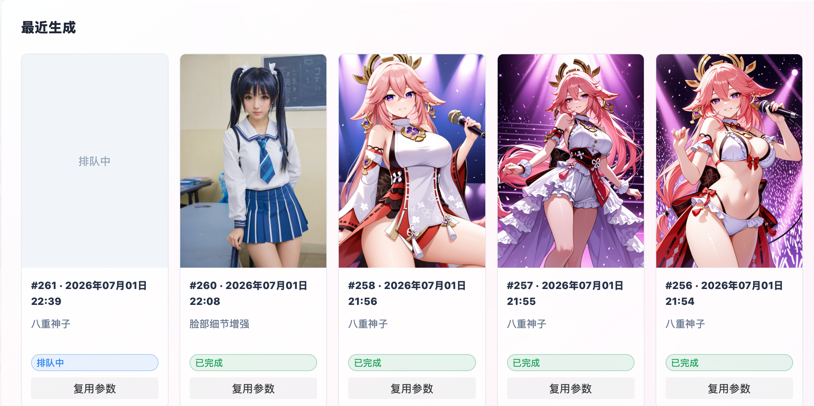

侧边栏里也可以进入“我的历史”和“AI 广场”。

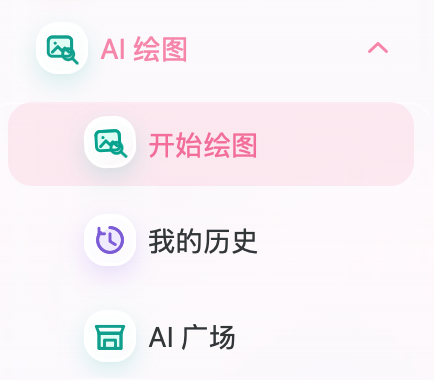

等待一会儿，AI 生成完成后，就可以查看图片了。

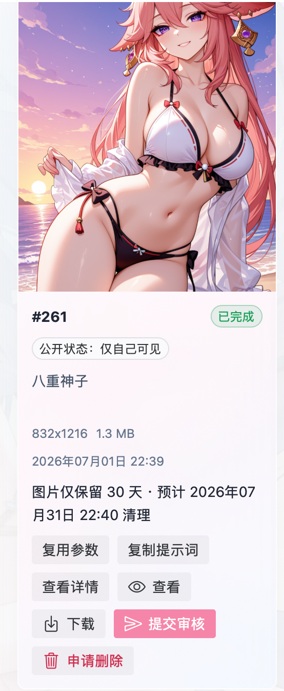

在“我的历史”里，还可以做这些操作：

- 复用参数
- 复制提示词
- 查看详情
- 查看图片
- 下载图片
- 提交审核
- 申请删除

如果你希望图片永久保存到网站服务里，可以提交审核。审核通过后，图片会公开展示在 AI 广场。

同样，如果之后不想展示了，也可以申请删除，管理员审核后会进行处理。

AI 广场这边，质量比较差的图片一般也不会通过永久保存审核。还是希望公开展示出来的作品尽量有一定质量。

## # 小结

AI 绘画服务今天就先讲到这里吧。

下班回来又是改代码，又是写预设，又是调 UI。预设越来越多，反而越来越麻烦。不过目前来看，至少电脑端用户的体验我觉得已经还不错了。

没想到这篇文章居然也写了快半小时，现在已经快 11 点了，该睡觉了。

明天还得继续当牛马，哎。

~~希望能有更多志同道合的朋友。~~

~~希望她能回来。~~

~~希望能睡个好觉。~~

~~希望你天天开心。~~

说梦话呢。
