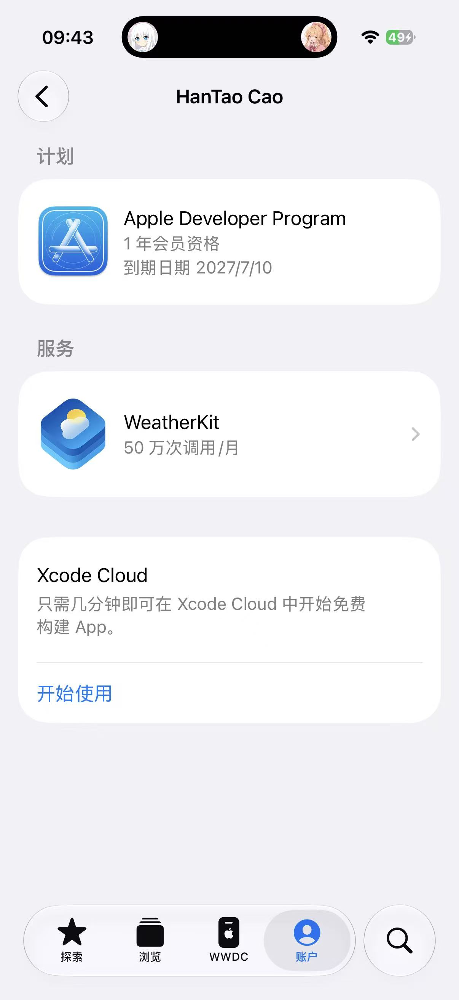

## # 苹果开发者申请终于通过了

今天，Apple Developer Program 的申请终于通过了，前后历时两天。

虽然等待时间不算特别长，但提交申请之后还是会忍不住时不时看一眼进度。现在开发者资格总算正式开通，雪涼云 iOS 版接下来的开发、测试和分发也可以继续往前推进了。

## # 雪涼云 iOS 版目前进度 70%

最近一直在把雪涼云往 iOS 应用的方向适配，目前整体开发进度大约完成了 **70%**。

这次并不只是简单地给网页套一层外壳。我还是希望它在手机上用起来更像一个真正的 App，所以主要精力都放在移动端体验上，尤其是平时使用频率比较高的播放器和刷图功能。

目前主要完成了这些内容：

- 优化播放器在移动端的交互和使用体验。
- 调整刷图页面，让手机上的浏览和连续操作更加顺手。
- 支持绑定 Apple 账号。
- 支持使用 Apple 账号直接登录。
- 为 AI 绘画任务接入 iOS 系统级推送通知。

基础功能大多已经可以正常使用，剩下的 30% 主要还是细节打磨、部分页面适配，以及真机使用过程中发现的一些小问题。

## # 播放器和刷图体验

播放器和刷图是这次移动端适配里比较重要的两块。

以前通过手机浏览器使用时，虽然功能能跑，但操作逻辑始终更偏向桌面端。屏幕尺寸、手势操作、页面切换和播放器控制这些地方，在手机上多少会有一点别扭。

所以这次做成 iOS 应用后，重点重新调整了移动端的交互。目标也很简单：打开之后可以直接用，不需要为了点一个按钮反复缩放页面，也不用在浏览内容时来回切换一堆界面。

目前整体体验已经比原来舒服不少，不过还需要继续真机使用一段时间。很多细节只有自己每天拿着手机去用，才会发现哪里不顺手。

## # Apple 账号绑定与登录

账号系统这次也加入了 Apple 相关能力。

现在用户可以把现有的雪涼云账号与 Apple 账号绑定，之后也可以直接通过 Apple 登录。对于 iPhone 用户来说，不需要额外记一套登录方式，整个过程会方便很多。

这部分对我来说也算是 iOS 应用化的重要一步。既然已经开始做原生应用体验，那么账号登录、通知和系统能力这些地方也应该尽量接入，而不是让它始终停留在“把网页放进 App”这个阶段。

## # AI 绘画完成后直接推送通知

AI 绘画这次也接入了 **iOS 系统级推送**。

以前提交绘画任务后，需要留在页面里等待，或者过一会儿再回来看看图片有没有生成完成。现在任务完成后，Apple 推送服务会直接向手机发送通知。

这样提交任务之后就可以先退出应用去做别的事情，不需要一直盯着进度。等收到通知，再打开雪涼云查看生成结果就好。

这个功能看起来不大，但对实际体验的提升很明显。特别是遇到队列较长或者生成速度比较慢的时候，终于不用隔一会儿就手动打开页面看一眼了。

## # 接下来

接下来会继续把剩下的细节补完，争取尽快完成雪涼云 iOS 版的第一阶段开发。

后续应该还会做一些小玩意，不过主要还是为了方便我自己日常使用。个人项目就是这样，很多功能的起点往往只是“我自己觉得这里不太方便”，然后顺手把它做出来。做完之后如果也能给其他人带来一点便利，那就更好了。

总之，开发者账号已经准备就绪，雪涼云 iOS 版也推进到了 70%。

继续慢慢做，把剩下的 30% 补完。
