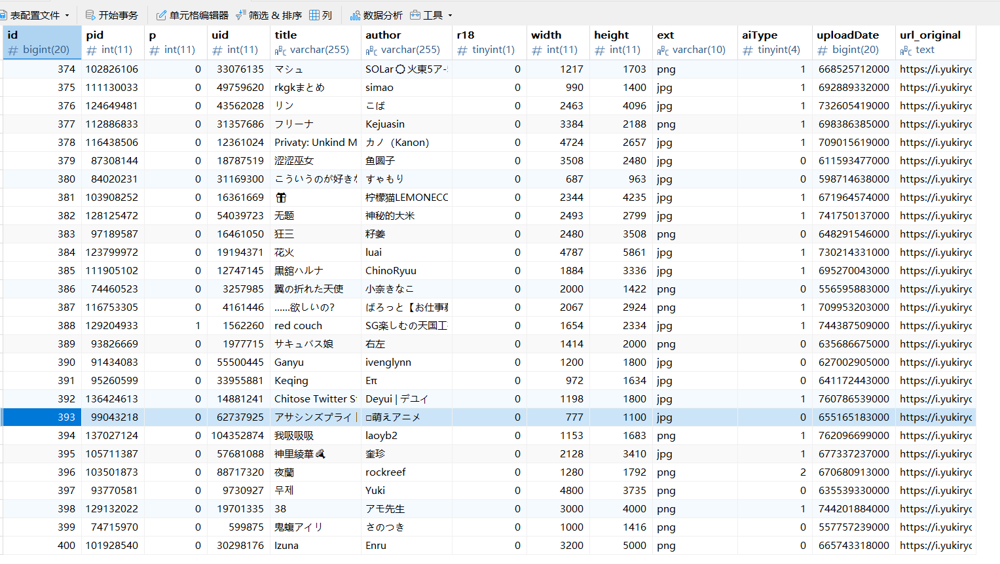

## 起因
最近一直在做p站的api，目前进度只有6000+的图片信息，数据库部分信息类似下图

1. 所有图片均来自 [Pixiv](https://www.pixiv.net/)，版权也归作品的作者所有，API 仅储存了作品的基本信息，不提供图片的储存服务
2. 为保证质量的话，所有图片信息都是根据本人xp来的，这里不过多解释了
总之就是任务还没完成，只能偷工减料了。

## QQ Bot
**qq号:2830323446**

---

## 成果一览

- **发图插件**

  - `setu` 随机仅从 **外部 API + 数据库** 取图；

  - `setu pid=... / uid=... / tag=...`：**官方优先**→失败自动回退 **API → DB**，并 **通知主人 ；

  - 随机策略：**随机跳页 + 水库采样**，避免“第一页偏置”；

## 优化过程
::github{repo="Tsuk1ko/pxder"}
通过以上项目可以获取到你自己账号的refresh_token，然后就可以愉快的获取pixiv的信息了。

---

  

## 具体实现（可直接复用的核心函数）

  

### 1) Pixiv 官方认证（refresh_token → access_token）

  

```python

import requests

from pixivpy3 import AppPixivAPI

  

_OAUTH_TOKEN_URL = "https://oauth.secure.pixiv.net/auth/token"

_CLIENT_ID = "MOBrBDS8blbauoSck0ZfDbtuzpyT"

_CLIENT_SECRET = "lsACyCD94FhDUtGTXi3QzcFE2uU1hqtDaKeqrdwj"

_UA = "PixivAndroidApp/5.0.234 (Android 11; Pixel 5)"

  

def exchange_by_refresh_token(refresh_token: str):

    headers = {

        "User-Agent": _UA,

        "Referer": "https://app-api.pixiv.net/",

        "App-OS": "android",

        "App-OS-Version": "11",

        "App-Version": "5.0.234",

    }

    data = {

        "client_id": _CLIENT_ID,

        "client_secret": _CLIENT_SECRET,

        "grant_type": "refresh_token",

        "refresh_token": refresh_token,

        "include_policy": "true",

    }

    r = requests.post(_OAUTH_TOKEN_URL, headers=headers, data=data, timeout=30)

    r.raise_for_status()

    j = r.json()

    if "access_token" not in j:

        raise RuntimeError(f"token 交换失败：{j}")

    return j["access_token"], j.get("refresh_token", refresh_token)

  

def make_aapi(refresh_token: str) -> AppPixivAPI:

    at, rt = exchange_by_refresh_token(refresh_token)

    aapi = AppPixivAPI(timeout=30)

    aapi.set_auth(at, rt)

    try: aapi.set_accept_language("zh-CN")

    except: pass

    return aapi

```

  

### 2) 随机策略：随机跳页 + 水库采样

  

```python

import random

  

def extract_pages(ill: dict) -> list[str]:

    out = []

    if ill.get("meta_pages"):

        for p in ill["meta_pages"]:

            img = p.get("image_urls") or {}

            u = img.get("original") or img.get("large") or img.get("medium")

            if u: out.append(u)

    if not out:

        if ill.get("meta_single_page", {}).get("original_image_url"):

            out.append(ill["meta_single_page"]["original_image_url"])

        else:

            img = ill.get("image_urls") or {}

            u = img.get("original") or img.get("large") or img.get("medium")

            if u: out.append(u)

    return out

  

def random_one_from_uid(aapi, uid: int, max_jumps: int = 30) -> str | None:

    res = aapi.user_illusts(uid)

    if not res or not getattr(res, "illusts", None): return None

    jumps = random.randint(0, max_jumps)

    cur = res

    for _ in range(jumps):

        if not getattr(cur, "next_url", None): break

        qs = aapi.parse_qs(cur.next_url)

        cur = aapi.user_illusts(**qs)

        if not cur or not getattr(cur, "illusts", None): break

    cand = getattr(cur, "illusts", []) or []

    if not cand: return None

    pages = extract_pages(random.choice(cand))

    return random.choice(pages) if pages else None

  

def random_one_from_tag(aapi, tag: str, max_jumps: int = 30) -> str | None:

    res = aapi.search_illust(tag, search_target="partial_match_for_tags")

    if not res or not getattr(res, "illusts", None): return None

    jumps = random.randint(0, max_jumps)

    cur = res

    for _ in range(jumps):

        if not getattr(cur, "next_url", None): break

        qs = aapi.parse_qs(cur.next_url)

        cur = aapi.search_illust(**qs)

        if not cur or not getattr(cur, "illusts", None): break

    cand = getattr(cur, "illusts", []) or []

    if not cand: return None

    pages = extract_pages(random.choice(cand))

    return random.choice(pages) if pages else None

```

  

  

### 3) 官方→API→DB 回退链路

  

```python

async def notify_owner(bot, owner_qq: int, text: str, event=None):

    try:

        if hasattr(bot, "send_private"):

            await bot.send_private(owner_qq, f"[setu告警] {text}"); return

    except Exception:

        pass

    if event is not None:

        await bot.send(event, f"[setu告警] @{owner_qq} {text}")

  

async def get_by_pid_uid_tag_with_fallback(session, bot, event, owner_qq, refresh_token,

                                           pid: int|None, uid: int|None, tag: str|None,

                                           fetch_from_api, fetch_from_db):

    try:

        aapi = await asyncio.to_thread(make_aapi, refresh_token)

        if pid is not None:

            det = await asyncio.to_thread(aapi.illust_detail, pid)

            ill = det.illust

            urls = extract_pages(ill) if ill else []

        elif uid is not None:

            u = await asyncio.to_thread(random_one_from_uid, aapi, uid)

            urls = [u] if u else []

        elif tag:

            u = await asyncio.to_thread(random_one_from_tag, aapi, tag)

            urls = [u] if u else []

        else:

            urls = []

        if urls: return urls

        await notify_owner(bot, owner_qq, "官方为空，回退 API", event)

    except Exception as e:

        await notify_owner(bot, owner_qq, f"官方异常：{e}，回退 API", event)

  

    # API

    try:

        api_urls = await fetch_from_api(session, [] if pid or uid else ([f"tag={tag}"] if tag else []))

        if api_urls: return api_urls[:1]

        await notify_owner(bot, owner_qq, "API 为空，回退 DB", event)

    except Exception as e:

        await notify_owner(bot, owner_qq, f"API 异常：{e}，回退 DB", event)

  

    # DB

    try:

        db_urls = await fetch_from_db(1, None, tag, uid)

        return db_urls[:1] if db_urls else []

    except Exception as e:

        await notify_owner(bot, owner_qq, f"DB 异常：{e}，最终失败", event)

        return []

```

---

## 结果

结果就是我发现标签查询效果更好了，标签匹配更吻合了，非常满意

