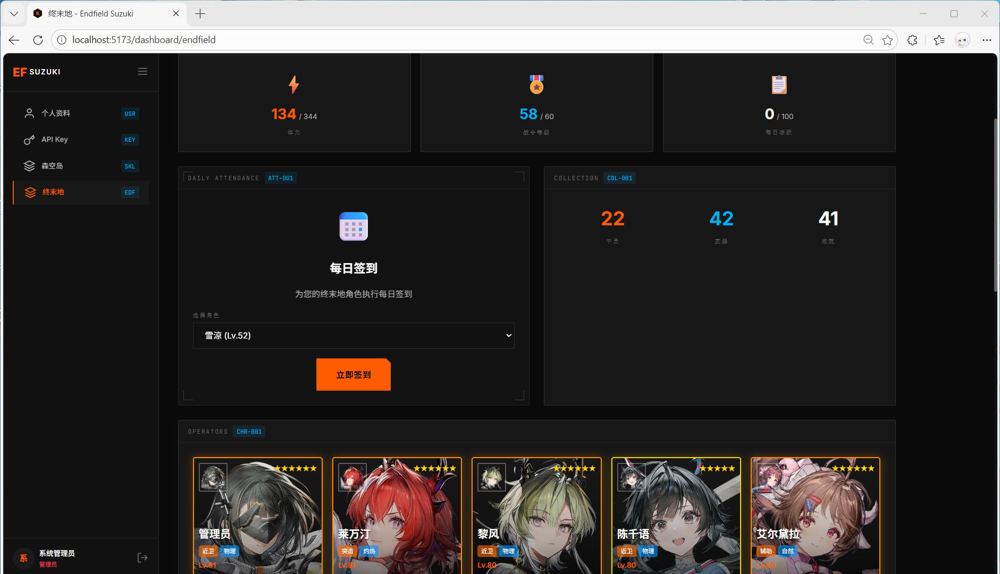
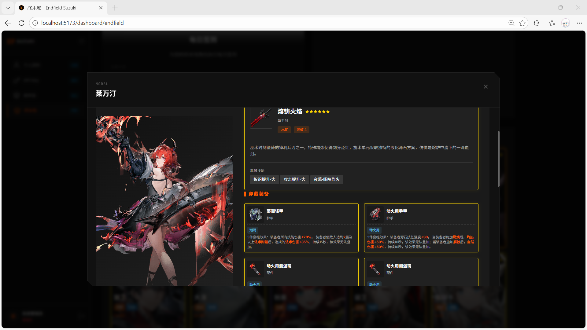

## # 前言：当工业党开始写代码

前段时间我也说过，自从《明日方舟：终末地》上线后，我就彻底沉迷于**拉电线**不可自拔。每天醒来第一件事就是规划电力布局，研究怎么让生产线跑得更顺畅。

但这几天，我把这股劲头转移到了另一个地方——**搓代码**。

既然官方的助手还有提升空间，不如自己动手丰衣足食？经过一番折腾，基于项目代码结构的深度分析，**终末地云 (Endfield Cloud)** 的核心功能模块终于算是有了个样子。今天就来盘点一下，这个"副业"到底实现了哪些功能。

---

## # 1. 终末地游戏助手：核心业务

这是本项目的重头戏，毕竟写在这个助手就是为了更舒服地看数据。目前的完成度已经非常高了，基本实现了与游戏数据的深度打通。

### 沉浸式角色详情

我一直觉得，看角色数据不应该只是盯着冷冰冰的表格。
- **全屏体验**：采用了单页面滚动设计，左侧是老婆（划掉）干员的精美立绘固定展示，右侧则是海量的数据面板。滑动的过程非常丝滑，体验感拉满。
- **深度数值**：从等级、属性到潜能，基础数值一目了然。
- **技能解析**：技能描述不再是纯文本，而是经过富文本渲染的，动态数值会有高亮显示，看起来非常直观。

### 武器与装备系统

这一块我花了挺多心思去还原游戏内的体验：
- **武器**：不仅仅是看个名字，稀有度、精炼/突破等级、详细描述及武器技能全都做了展示。
- **装备**：完整还原了游戏里的装备栏（护甲、护手、饰品）。最重要的是，**套装效果**和属性加成也能直接看到，不用再凭记忆去凑套装了。
- **战术道具**：展示携带的战术道具及其主动/被动效果，细节拉满。

### 日常运营工具

作为一个"懒人"，自动化工具是必不可少的：
- **一键签到**：支持森空岛自动签到功能，每日获取游戏奖励（这才是最实用的！）。
- **资源监控**：实时查看体力值 (Stamina)、战令等级 (Battle Pass) 和每日活跃度，不用上游戏也能知道体力溢出没。
- **数据概览**：干员、武器和成就的收集统计，看着进度条一点点涨满，强迫症表示很舒适。

---

## # 2. 森空岛账号管理：连接一切

为了拿到上面的数据，和 Eagle/Hypergryph 账号体系的连接与鉴权是基础。

- **多方式绑定**：支持密码、验证码、Token 等多种方式进行森空岛账号绑定，总有一种适合你。
- **凭证维护**：为了实现"长期免登录"，系统支持自动刷新 Credential。绑定一次，之后就不用管了，确确实实的"无感体验"。
- **状态监控**：实时展示绑定状态 (UID、绑定时间、凭证有效性)，出了问题也能第一时间知道。
- **多角色支持**：自动识别账号下绑定的所有游戏角色（终末地、明日方舟等），不用切号切来切去。

---

## # 3. 用户体验：要硬核也要好看

在 UI/UX 上，我还是坚持了自己的审美标准。

### 视觉风格
- **终末地主题**：既然是终末地的助手，风格自然要统一。全站采用**深色科技风 (Sci-Fi Dark Mode)**，大量运用**玻璃拟态 (Glassmorphism)** 和霓虹光效。
- **动态稀有度**：所有游戏物品（武器、装备）均带有基于稀有度的动态边框光效（金/紫/蓝等）。看着那一圈金光，心情都变好了。

### 交互细节
- **响应式设计**：针对手机端专门优化了布局。比如装备栏在手机上是单列展示，模态框也是全屏的，操作体验跟原生 App 没什么区别。
- **Loading 状态**：全站关键数据加载均带有优雅的 Loading 状态和过渡动画，拒绝生硬的白屏等待。

---

## # 4. 用户中心与基础服务

这部分虽然枯燥，但却是系统稳定运行的基石。

- **个性化**：集成了一个好用的头像裁剪工具，支持缩放、旋转，想怎么截就怎么截。
- **API 开放**：甚至还做了一个 `ApiKeysPage`，提供开发者 API Key 的生成与管理功能。虽然现在可能只有我自己在用，但梦想还是要有的嘛。
- **基础服务**：完整的注册登录流程，加上 Toast 消息提示系统，操作成功还是失败都有即时反馈。

---

## # 总结

总的来说，目前的 Endfield Cloud 已经具备了一个成熟游戏助手的所有关键要素。从账号绑定到深度的游戏数据展示，再到移动端体验，基本达到了我预期的效果。

接下来？也许会继续优化一下性能，或者看看能不能挖掘出更多有趣的数据玩法。

反正，**电线要拉，代码也要写**。工业党的快乐，就是这么朴实无华。

*(本文图片均为开发中截图，实际效果以上线版本为准)*
