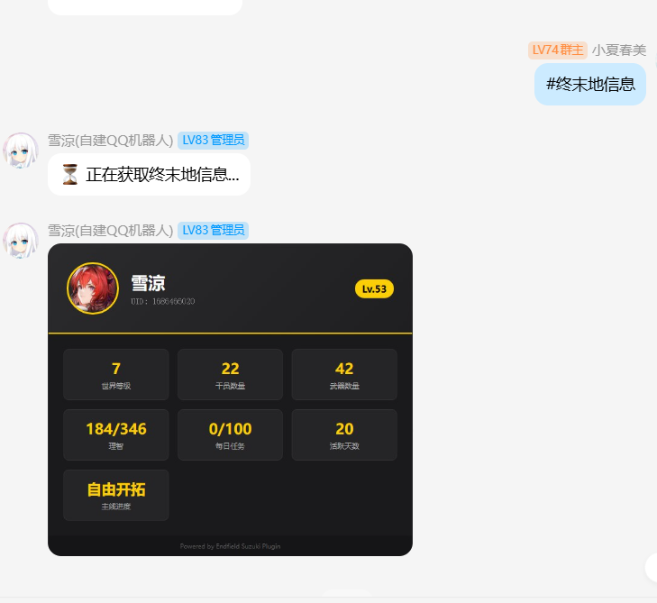
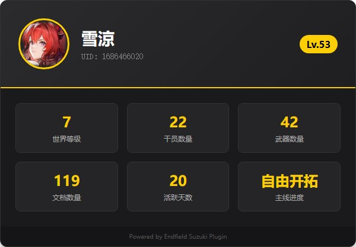
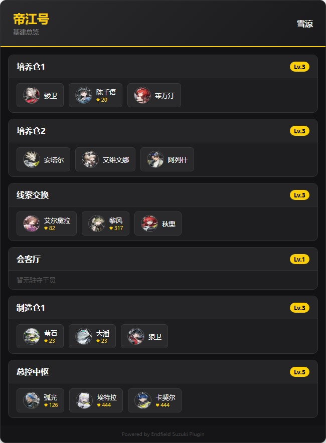
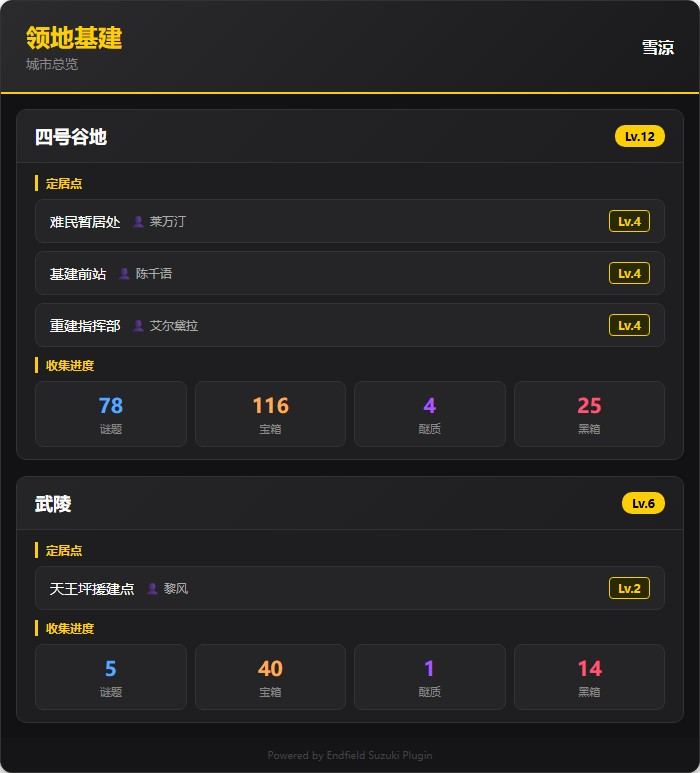

## # 前言：助手做完了，机器人也得安排上

上一篇文章聊了 Endfield Cloud 网页端助手的开发进度，但光有网页版总觉得差点意思——毕竟大家平时泡在 QQ 群里的时间明显更多。

于是就有了这个想法：**给 Yunzai Bot 写个终末地插件**。

> 目标很简单：在群里发一条指令就能查角色、看体力、自动签到，不用打开浏览器也不用登录网页。

说干就干，花了几天时间，插件的核心功能算是搓出来了。不过开发过程嘛……怎么说呢，**踩的坑比写的代码还多**。

---

## # 1. 功能一览：群里发条消息就能查

先说成果。下面这张图是在 QQ 群里实际使用的效果——群友发了 `#终末地信息`，机器人就会自动渲染并回复一张资料卡片：



可以看到卡片里包含了等级、世界等级、干员数量、武器数量、理智、每日任务进度等关键数据，**一条消息全搞定**。

### 账号绑定

绑定是一切的基础。为了照顾不同用户的习惯，做了两种绑定方式：
- **Token 绑定**：`#终末地绑定 <token>`，一步到位，适合会抓 Token 的玩家
- **手机验证码绑定**：`#终末地手机绑定 <手机号>`，两步验证，小白也能用

安全方面也做了考虑——群聊中自动提示去私聊绑定，万一有人不小心在群里发了 Token，插件会**自动撤回消息**。毕竟 Token 泄露可不是闹着玩的。

### 个人资料卡片

`#终末地角色` 会生成一张精美的个人概览卡片：



世界等级、干员数量、武器数量、文档数量、活跃天数、主线进度……该有的都有了。所有内容通过 **Puppeteer 渲染成图片**，不是那种纯文本糊脸的效果。

当然，也支持 `#终末地角色 <名字>` 查看指定角色的详细信息卡片（等级、专精、技能等）。

### 帝江号（飞船基建）

`#终末地帝江号` 可以查看飞船的各房间状态：



培养仓、线索交换、会客厅、制造仓、总控中枢——每个房间的**等级和驻守角色**一目了然。谁在哪个房间摸鱼一眼就能看出来。

### 领地基建

`#终末地基建` 展示领地采集进度与资源产出：



各区域的定居点信息、收集进度（谜题、宝箱、殿质、黑箱）都做了可视化展示。不用进游戏就能掌握领地运营状况。

> ⚠️ 顺便说一句，由于游戏内部分道具的数据结构还没有完全理解透，少部分数据的对应关系**可能存在偏差**，不过绝大部分信息是准确的。后续随着对游戏数据的深入挖掘会持续修正。

### 自动签到 & 提醒

作为一个懒人，自动化才是核心竞争力：

- **`#终末地签到`**：手动签到（虽然叫手动，但其实只是发条消息的事）
- **自动签到**：每天定时自动为所有绑定用户签到，真正的**躺平式签到**
- **体力提醒**：每 30 分钟检查一次，体力快满了会私聊提醒你，再也不怕溢出
- **每日任务提醒**：每天晚上 9 点检查，活还没干完的会收到温馨催促

> 说实话，有了这套东西之后，打开游戏的频率反而更高了——因为被提醒得太勤了。

### 管理与配置

- 支持 **Guoba 面板**配置（API Key、API 地址、自动签到时间、体力阈值等）
- 自带**自动更新**功能，不用手动 `git pull`
- **`#终末地帮助`**：列出所有可用命令，防止忘记

---

## # 2. 踩坑实录：开发血泪史

功能做出来了是好事，但过程嘛……真的是一路踩坑。下面来盘点几个印象最深的。

### 坑 1：Node.js 版本兼容性

**症状**：插件一启动就报错，`import.meta.dirname` 是 `undefined`。

我一开始用了 `import.meta.dirname` 来获取当前目录路径，写起来确实很爽。但这玩意是 **Node.js 21.2+ 才有的新特性**，问题是大部分跑 Yunzai Bot 的服务器都是老版本 Node……

**教训**：写插件就别用太新的语法了，老老实实用兼容写法：

```javascript
// ❌ 看起来很优雅，但跑不起来
const dir = import.meta.dirname

// ✅ 虽然丑了点，但到处都能跑
import { fileURLToPath } from 'url'
import path from 'path'
const __filename = fileURLToPath(import.meta.url)
const __dirname = path.dirname(__filename)
```

这一改，`api.js`、`data.js`、`index.js`、`apps/update.js`、`guoba.support.js` 全都得跟着改。

### 坑 2：Puppeteer 渲染图片全裂了

**症状**：渲染出来的卡片，角色头像、技能图标全是碎图标。

排查了半天，发现是图片 URL 带了**阿里云 OSS 的图片处理参数** `x-oss-process=image/...`，Puppeteer 加载这种处理后的 URL 会翻车。

**解决**：简单粗暴，直接返回原始 URL，不让 OSS 瞎处理：

```javascript
static resize(url) {
    return url  // 就这么一行，问题就没了
}
```

> 有时候最简单的方案就是最好的方案。

### 坑 3：CSS 样式时有时无

**症状**：渲染出的图片**有时候好好的，有时候就是纯白底+默认字体**，玄学问题。

这个坑排查了很久。最终发现是 `page.addStyleTag({ path: 'xxx.css' })` 的锅——这种注入外部 CSS 的方式存在**时序问题**，页面可能在 CSS 加载完成前就渲染了。

**解决**：把所有 CSS 内联到 HTML 里，用 `<style>` 标签直接嵌进去：

```javascript
const css = fs.readFileSync('resources/profile.css', 'utf8')
const html = `<style>${css}</style><div class="card">...</div>`
```

从此以后再也没出过玄学样式问题。

### 坑 4：并发刷新凭证的竞态条件

**症状**：两个用户同时查询的时候，其中一个必定失败，报「凭证已失效」。

这是一个经典的**竞态条件 (Race Condition)** 问题。两个用户的请求同时返回 401，触发两次并发的凭证刷新。第二次刷新会覆盖第一次的结果，导致第一个用户拿到的凭证其实已经被废掉了。

**解决**：实现了一个 **per-bindingId 的刷新锁**，同一个 bindingId 的并发刷新只会执行一次，后续请求等待已有刷新完成即可：

```javascript
async requestWithAutoRefresh(path, method, body, bindingId) {
    // 请求失败需要刷新时...
    if (this._refreshLocks.has(bindingId)) {
        // 已经有人在刷新了，排队等着就好
        await this._refreshLocks.get(bindingId)
    } else {
        // 我先来！注册刷新任务
        const p = this.refreshCred(bindingId)
            .finally(() => this._refreshLocks.delete(bindingId))
        this._refreshLocks.set(bindingId, p)
        await p
    }
    // 重试请求...
}
```

这个 bug 花了不少时间才定位到，但修好之后非常有成就感。

### 坑 5：多账号查询数据窜台

**症状**：用户 A 查自己的角色，看到的却是用户 B 的数据。这可太恐怖了。

**原因**：请求 API 的时候没传 `bindingId` 参数。后端的 fallback 逻辑按 `external_user_id` 查询，结果因为该字段都是 null，就按创建时间倒序返回了最新绑定的那个人的数据——也就是说**永远返回最后一个绑定的用户的数据**。

**解决**：所有 API 请求都显式带上 `bindingId`：

```javascript
// 修复前：你猜你看到的是谁的数据？
api.requestWithAutoRefresh('/skland/endfield/card', 'GET')

// 修复后：明确告诉后端我要谁的数据
api.requestWithAutoRefresh(
    `/skland/endfield/card?bindingId=${bindingId}`,
    'GET', null, bindingId
)
```

`card.js`、`spaceship.js`、`domain.js`、`reminder.js`、`signin.js` 全都得改。这种低级错误只能说**测试不够充分**，引以为戒。

### 坑 6：签到结果解析爆炸

**症状**：签到其实成功了，但消息显示不正确；重复签到也没有正确提示。

**原因**：后端偷偷更新了返回格式，签到结果从嵌套对象 `{ award: [...] }` 变成了直接返回字符串。客户端还在老实巴交地解析老格式，自然就炸了。

**解决**：兼容新格式，顺便做了下容错：

```javascript
const signinData = result.data
if (typeof signinData === 'string' && signinData.includes('已签到')) {
    return e.reply('📋 今日已签到')
}
let msg = `✅ ${signinData || '签到成功！'}`
```

> **前后端联调最大的敌人不是 bug，是「接口改了但没告诉你」。**

---

## # 3. 技术栈

简单列一下，方便感兴趣的朋友参考：

| 模块 | 技术 |
|------|------|
| 运行环境 | Yunzai Bot v3（Node.js） |
| 后端 | 自建 Endfield Cloud API（Spring Boot） |
| 渲染 | Puppeteer（HTML/CSS → 图片） |
| 数据存储 | JSON 文件（bindings.json） |
| 配置 | YAML（config.yaml）+ Guoba 面板 |
| 依赖 | node-fetch、yaml、puppeteer |

---

## # 总结

回过头看，这个插件的功能其实不算复杂，但开发过程中踩的坑真的不少。**Node.js 版本兼容、Puppeteer 渲染玄学、并发竞态、数据窜台**……每一个都够喝一壶的。

不过也正因为这些坑，才让我对 Yunzai Bot 插件开发有了更深的理解。尤其是并发刷新锁那个，感觉以后在别的项目里也能用上。

插件已经开源了，感兴趣的可以去 GitHub 看看：

::github{repo="yoshino-xiao7/endfield-suzuki-plugin"}

如果你也在玩终末地，欢迎来试试。有 bug 或者建议直接提 issue 就好，虽然我修 bug 的速度可能取决于**当天有没有在拉电线**。

> 电线要拉，插件也要写。工业党的快乐，就是这么朴实无华且枯燥。
