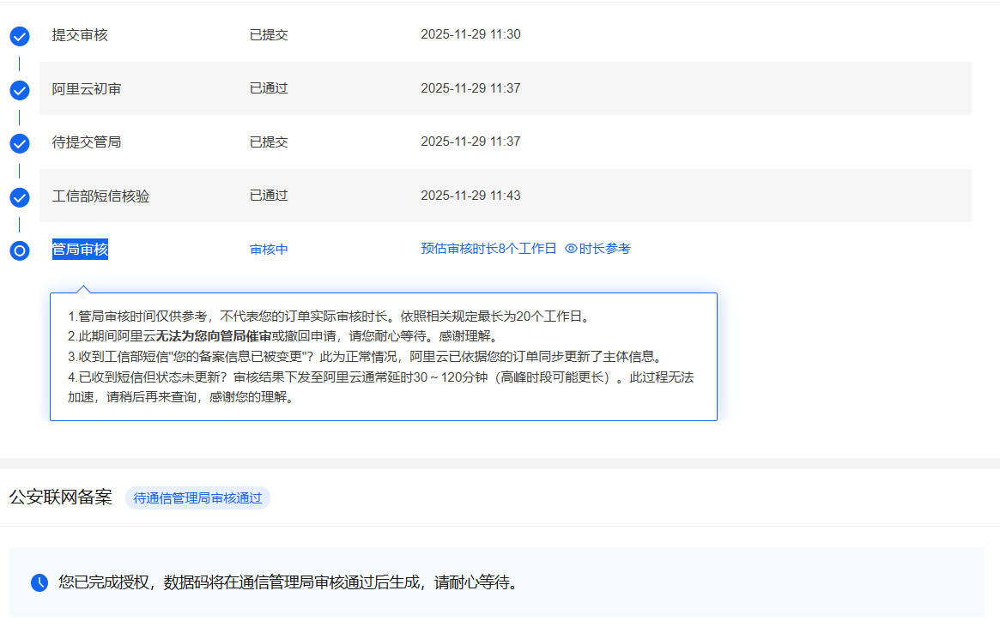

## 准备工作
我们都知道国内服务器是需要备案的，但备案需要准备些什么呢？
1. 首先选择一家合适的域名服务商进行代备案，我选择的是阿里云。
2. 其次我们需要准备一个可备案域名和国内云服务器。
## 开始
准备好之后就可以申请备案了，我本以为备案会很复杂，但我提交申请到阿里云提交到管局审核也没花很长时间，不过我申请的时间是在周末，我想应该需要下周六才能通过了吧。
## 结束
附一张申请记录做为纪念

