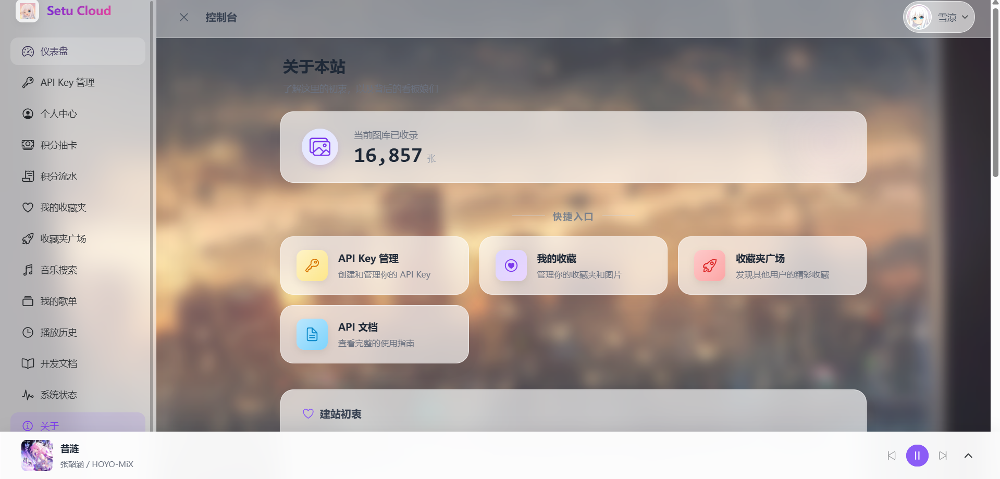
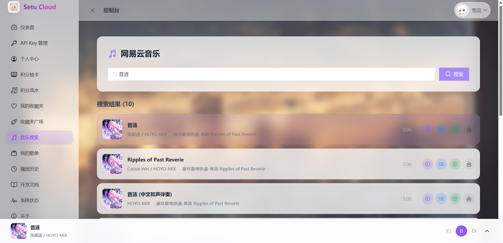
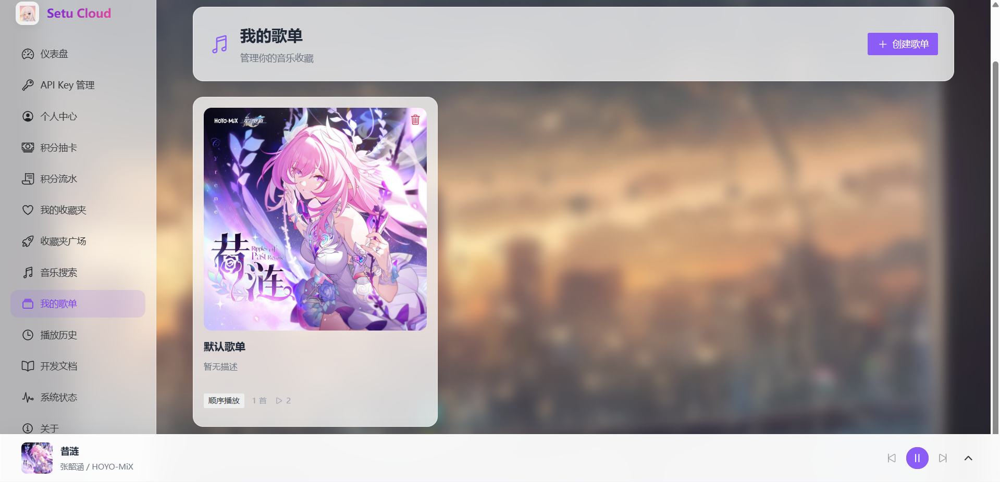
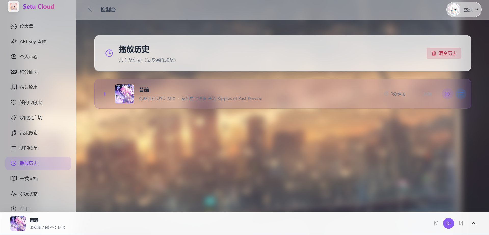

## 序言

距离 Setu Cloud v2 正式上线已经过去两周了，这段时间收到了很多小伙伴的反馈和建议。在保持原有图片 API 服务稳定运行的基础上，我们决定做一些"不务正业"的事情——给控制台加入音乐播放功能！

没错，现在你可以一边管理 API Key，一边听着网易云音乐放松心情了。这次更新不仅仅是简单的功能堆砌，而是从用户体验出发，打造了一套完整的音乐管理系统。

Setu Cloud 地址: [https://cloud.yukiryou.icu/](https://cloud.yukiryou.icu/)

---

## 核心更新

### 1. 全局音乐播放器

我们在控制台底部集成了一个**全局音乐播放器**，无论你切换到哪个页面，音乐都不会停止。

**主要特性：**
- **固定底部设计**：采用毛玻璃效果，与整体 UI 风格完美融合
- **展开/收缩模式**：可一键切换简洁/完整模式，节省屏幕空间
- **完整播放控制**：上一曲、播放/暂停、下一曲、播放模式切换
- **实时进度条**：可拖拽跳转到任意时间点
- **音量调节**：支持静音和音量滑块控制
- **歌词展示**：点击展开歌词面板，支持点击跳转、自动滚动跟踪

### 预览

---

### 2. 音乐搜索与播放

集成了网易云音乐 API，可以搜索海量曲库并在线播放。

**核心功能：**
- **智能搜索**：支持歌曲名、歌手、专辑全文检索
- **快速操作**：每首歌提供 4 个快捷按钮
  - 🎵 **播放**：立即播放并加入播放列表
  - 📋 **添加到播放列表**：仅添加不播放，适合批量收藏
  - ➕ **添加到歌单**：保存到自定义歌单
  - ⬇️ **下载**：一键下载高品质音频
- **字段映射优化**：完美适配网易云 API 返回格式
- **超时处理**：30 秒超时配置，避免长时间等待

### 预览

---

### 3. 我的歌单

支持创建自定义歌单，管理你的音乐收藏。

**歌单管理功能：**
- **创建歌单**：自定义名称、描述、封面 URL
- **编辑歌单**：随时修改歌单信息
- **播放模式**：支持 4 种播放模式
  - 顺序播放：按顺序播放到最后停止
  - 随机播放：随机选择下一首
  - 列表循环：播放完自动回到第一首
  - 单曲循环：重复播放当前歌曲
- **歌曲排序**：拖拽调整播放顺序
- **一键播放**：直接播放整个歌单
- **公开/私密**：控制歌单是否对外可见

### 预览

---

### 4. 播放历史

自动记录播放历史，最多保留 50 条记录。

**历史功能亮点：**
- **智能时间显示**：
  - 1 分钟内 → "刚刚"
  - 1 小时内 → "5 分钟前"
  - 今天 → "今天 14:30"
  - 昨天 → "昨天 20:15"
  - 其他 → "12 月 25 日 18:00"
- **分页浏览**：支持 10/20/50 条每页
- **快速播放**：点击历史记录直接播放
- **清空历史**：一键清空所有记录

### 预览

---

### 5. 播放列表管理

类似网易云音乐的播放队列功能。

**列表特性：**
- **实时队列**：显示当前播放列表
- **音波动画**：正在播放的歌曲有动态指示器
- **快速操作**：点击播放、移除歌曲、清空列表
- **数字徽章**：显示列表中的歌曲数量
- **抽屉设计**：侧边滑出，不遮挡主要内容

---

## 技术实现细节

这次音乐功能的实现，涉及了不少技术挑战：

### 前端架构
- **全局状态管理**：使用 Pinia 管理音乐播放状态、歌单、历史记录
- **HTML5 Audio API**：原生 audio 元素控制播放
- **自动播放优化**：监听 `canplay` 事件，确保音频加载完成后再播放
- **歌词解析**：正则表达式解析 LRC 格式歌词 `[mm:ss.xx]歌词内容`
- **播放模式逻辑**：根据不同模式计算下一曲索引

### 后端集成
- **网易云 Token 管理**：管理员可配置多个 Cookie，自动轮换使用
- **播放历史存储**：每次播放自动调用后端 API 记录
- **字段映射**：前端转换网易云 API 字段 (ar→artists, al→album, dt→duration)

### 用户体验优化
- **请求超时**：默认 30 秒超时，搜索结果限制 10 条避免卡顿
- **毛玻璃效果**：backdrop-filter: blur(20px) 打造视觉统一性
- **响应式设计**：移动端自动隐藏部分信息，保持界面简洁
- **平滑动画**：过渡动画让交互更流畅

---

## 快速上手指南

想要体验音乐功能？只需两步：

**第一步：登录控制台**
访问 Setu Cloud 官网并登录你的账号。

**第二步：开始听歌**
在左侧菜单点击 **「音乐搜索」**，输入你想听的歌曲，点击播放按钮即可。底部会出现全局播放器，切换页面也不会停止播放！

**可选：创建歌单**
点击 **「我的歌单」** -> **「创建新歌单」**，输入歌单名称和描述，然后从搜索页面添加歌曲到歌单。下次可以直接播放整个歌单。

**可选：查看历史**
点击 **「播放历史」**，可以看到最近播放的 50 首歌曲，点击即可重新播放。

---

## 技术栈更新

音乐功能基于以下技术实现：

**前端：**
- Vue 3 Composition API (script setup)
- Pinia 状态管理 (音乐 store)
- HTML5 Audio API
- Naive UI (NModal, NDrawer, NBadge 等组件)
- TypeScript 严格类型检查

**后端集成：**
- 网易云音乐 API 代理
- Cookie 池管理与轮换
- 播放历史持久化存储
- 歌单 CRUD 接口

**优化细节：**
- 音频预加载与缓冲处理
- 歌词实时滚动算法
- 播放模式状态机
- 全局播放器生命周期管理

---

## 已知问题 & 后续计划

**已知问题：**
- 部分歌曲因版权原因无法播放（网易云 API 限制）
- 歌词可能存在时间轴不准的情况（取决于网易云数据质量）

**后续计划：**
- [ ] 支持歌单分享功能
- [ ] 添加歌词翻译显示
- [ ] 引入歌手/专辑详情页
- [ ] 支持本地上传音乐
- [ ] 添加音乐可视化效果

---

## 结语

Setu Cloud 从一个简单的图片 API 服务，逐渐演变成了一个多功能的娱乐控制台。音乐功能的加入，让开发者在管理 API 的同时也能享受片刻的放松。

这次更新耗时约一周，从需求设计到功能实现，再到 UI 打磨，每一个细节都经过了反复推敲。虽然"不务正业"，但确实提升了使用控制台的幸福感😊

欢迎大家登录体验，如果有任何建议或遇到 BUG，欢迎通过邮件或 QQ 反馈！

说个题外话，一边写代码一边循环播放《昔涟》真的很上头，崩铁的音乐制作真的绝了！推荐大家搜索试试这首歌～

---

**相关链接：**
- Setu Cloud: [https://cloud.yukiryou.icu/](https://cloud.yukiryou.icu/)
- 反馈邮箱: yuki@yukiryou.online
